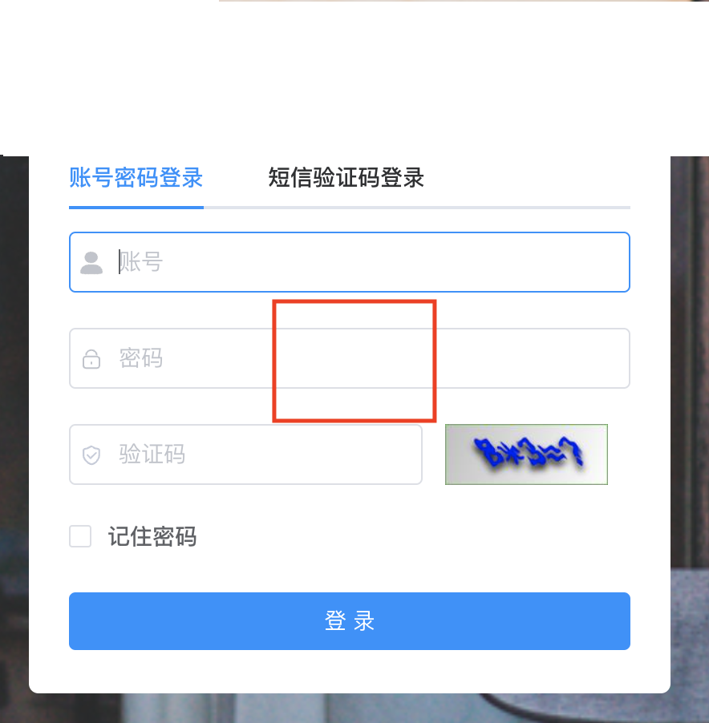

<h4 align="center">基于Ruoyi v3.8.6 前后端分离的Java快速开发框架 v5.0.0</h4>

## 一. 框架简介

本框架基于 [若依分离版](http://doc.ruoyi.vip/ruoyi-vue/) 进行二次开发，若依的所有功能均可正常使用，并涵盖了更多的基础功能和公共业务模块。

## 二. 使用说明

当有一个新项目要进行开发，需要进行如下操作。

### 1. 下载项目

下载开发框架。下载完成后，进行解压，解压后将目录名修改为您的项目名称（英文）。

> 开发框架 和 开发框架Plus的区别：开发框架使用原生MyBatis，开发框架Plus使用MyBatis-Plus。

### 2. 修改项目包路径

- 进入项目目录，修改 new_project.sh （或 new_project_mac.sh）

```shell
## 找到
projectName="xx-sys"
projectCN="XX管理系统"

## 根据实际项目进行修改
projectName="gangu"
projectCN="干谷社区管理系统"
```

- 执行脚本

```shell
## Linux 系统
bash new_project.sh

## MAC 系统
bash new_project_mac.sh
```

## 三. 开发说明

### 1. 将项目导入到你的IDE中

### 2. 根据实际项目修改配置

```yml
## application.yml
spirit:
  profile: <文件上传目录>
  
## application-druid.yml
spring:
  datasource:
    type: com.alibaba.druid.pool.DruidDataSource
    driverClassName: com.mysql.cj.jdbc.Driver
    druid:
      # 主库数据源
      master:
        url: jdbc:mysql://<数据库url>/<数据库>?useUnicode=true&characterEncoding=utf8&zeroDateTimeBehavior=convertToNull&useSSL=true&serverTimezone=GMT%2B8
        username: <数据库账号>
        password: <数据库密码>
```

### 4. 业务开发

项目在业务逻辑都在 `项目名-biz`模块下进行开发。如果要修改模块的名称，则需要修改以下地方。例如：修改为 `xx-build`

- `项目名-biz` 下 pom.xml

```xml
<!-- 找到 -->
<artifactId>项目名-biz</artifactId>
<!-- 修改为 -->
<artifactId>xx-build</artifactId>
```

- 项目根目录下的 pom.xml

```xml
<!-- 找到 -->
<dependency>
  <groupId>com.spirit</groupId>
  <artifactId>项目名-biz</artifactId>
  <version>${project.version}</version>
</dependency>
...
<module>项目名-biz</module>

<!-- 修改为 -->
<dependency>
  <groupId>com.spirit</groupId>
  <artifactId>xx-build</artifactId>
  <version>${project.version}</version>
</dependency>
...
<module>xx-build</module>
```

- `项目名-admin` 下的 pom.xml

```xml
<!-- 找到 -->
<dependency>
  <groupId>com.spirit</groupId>
  <artifactId>项目名-biz</artifactId>
</dependency>

<!-- 修改为 -->
<dependency>
  <groupId>com.spirit</groupId>
  <artifactId>xx-build</artifactId>
</dependency>
```

### 5. 项目启动

Windows环境下，可能会报如下错误，需要添加 JVM 启动参数 `-Djdk.io.File.enableADS=true`

```ABAP
java.lang.NoClassDefFoundError: Could not initialize class org.xnio.conduits.Conduit
```

### 6. 图片代理

若依默认的图片请求访问后台地址会根据`/profile`进行匹配，这里修改为`/project-profile`（默认，会随项目而定）。主要是为了解决同一台服务器上部署多个项目，引发路径重复的问题。

修改的位置：`project-common 下 Constants.java 中的 RESOURCE_PREFIX`

### 7. 邮件服务

框架自带邮件服务，可用于发送邮件。

- 使用邮件服务，需要进行修改配置 application.yml

```yaml
## 修改下面的配置
mail:
  ## SMTP 服务器
  host: smtp.163.com    
  ## 发送端的用户邮箱名      
  username: test@163.com
  ## 发送端的密码（授权密码，不是邮箱密码）
  password: 123456
```

- 邮件服务类 `EmailFactory`，测试类 `EmailFactoryTests`

### 8. 短信服务

框架自带短信服务，可用于发送短信。

- 修改系统参数


- 短信服务类 `SmsFactory`，测试类 `SmsFactoryTests`

### 9. 登录增强

框架对登录功能进行了增强，增加短信验证码登录方式。若只需要账号登录，将 `login.vue` 中的 `smsEnabled` 设为 false 即可。



### 10. 业务附件

框架对附件上传功能进行了增强，新增附件表`sys_attachment`。使用时需要传递业务模块`bizModel`。

```vue
<!-- 业务模块名可以设置为业务模块的domain -->
<file-upload v-model="form.attachment" :bizModel="'<业务模块名>'" :disabled="disabled"/>
```

### 11. 项目健康指数和客户活跃度感知

框架添加项目健康指数和客户活跃度感知统一接口，用于检测已交付项目客户使用的活跃度。接口的实现类为 `SysMonitor4spiritController`，BaseURI 是 `/spirit/monitor`，接口可匿名访问。

BaseURI：`/spirit/monitor`，请求方式：POST

| 接口名                 | URI                                  | 参数                          | 状态                       |
| ---------------------- | ------------------------------------ | ----------------------------- | -------------------------- |
| 每日用户访问数         | /user_visit_count/{queryDate}        | 查询日期，格式必须为 yyyyMMdd | 框架自带                   |
| 每日新用户新增数       | /user_increase_count/{queryDate}     | 查询日期，格式必须为 yyyyMMdd | 框架自带                   |
| 每日核心业务数据新增数 | /business_increase_count/{queryDate} | 查询日期，格式必须为 yyyyMMdd | 未实现，需业务系统自行实现 |

### 12. 信息发布

框架添加了栏目分类、栏目属性、信息发布功能，包含信息草稿、审批、发布、浏览、信息属性功能。菜单位于**系统管理 —> 信息管理**。

涉及角色：信息录入员、信息管理员

功能权限说明：

| 功能                                                        | 角色                             |
| ---------------------------------------------------------- | -------------------------------- |
| 新增、修改、删除                                              | 信息录入员（√）  信息管理员（√） |
| 栏目分类、批量通过、批量驳回、通过、驳回                             | 信息录入员（X）  信息管理员（√） |
| 匿名访问设置、评论设置、设置访问范围、启用、停用、置顶 | 信息录入员（√）  信息管理员（√） |

其他说明：

- 置顶：同时只能有一条记录被置顶。

- 设置访问范围后，匿名访问会被取消。

### 13. 代码示例

框架添加了代码示例菜单（系统工具—> 代码示例），包含了日常开发中一些通用、特别的功能，便于开发人员参考。


### 14. 增强工具

- Word导出

  添加依赖Poi-tl 1.10.4

- Word转PDF

  工具类Word2PdfUtil.java，测试类Word2PdfUtilTests

- Hutool

  添加依赖 Hutool 5.8.4。官网：https://hutool.cn/docs

  开发时，不要去写太多的工具类，Hutool包含的工具类已经覆盖了99%的场景，我们只需写业务相关的工具类。

- 汉字转拼音工具类

  添加依赖 pinyin4j 2.5.0，工具类PinyinUtil.java

- 添加 lombok 插件

- Moment.js

  添加 Moment.js 2.29.4，前端日期处理类库。官网：http://momentjs.cn

  ```js
  this.$moment(new Date()).format("YYYY-MM-DD")	// 2022-10-24
  ```

- 集成jsencrypt实现密码加密传输方式

  ```js
  import { encrypt, decrypt } from '@/utils/jsencrypt'
  
  encrypt(this.loginForm.password)
  decrypt(this.loginForm.password)
  ```

- 添加全局Base64编码/解码工具类（since v4.0.0）

```js
const encode = this.encodeBase64('精灵科技')
console.log(encode)
const decode = this.decodeBase64(encode)
console.log(decode)
```

### 15. 代码生成

框架对代码生成进行了修改，修改内容如下

- 去除PUT、DELETE方式的HTTP方法，替换为POST。<br>（安全考量，https://cloud.tencent.com/developer/article/1472910）
- 列表页和详情页分离，便于组件化开发。
- 添加查看按钮及相关逻辑。
- 根据数据库设计，自动的为文本框和文本域设置 `maxlength` 和 `show-word-limit`。
- 添加左侧部门树单表模板。

### 16. 视频播放组件

（前端）框架添加视频播放组件，`@/components/Video`，可用于对接视频监控功能。具体使用方式请参考代码示例。

### 17. 页面水印

（前端）框架添加了页面水印功能。具体使用方式请参考代码示例。

### 18. 审批记录

框架设计了一个统一的审批记录表，`sys_approval_log`。当业务中有审批逻辑时，在 `sys_approval_log` 中插入一条数据。相关的处理类为`ISysOperLogService.java`、`ApprovalFlowConstats.java`。

### 19. 富文本编辑器

框架更换了原来的富文本编辑器`quill`，更换为 [Tinymce](https://www.tiny.cloud/docs)。`TinyMCE`的优势：

- 开源可商用，基于LGPL2.1
- 插件丰富，自带插件基本涵盖日常所需功能
- 接口丰富，可扩展性强，有能力可以无限拓展功能
- 界面好看，符合现代审美
- 提供经典、内联、沉浸无干扰三种模式
- 对标准支持优秀（自v5开始）
- 多语言支持，官网可下载几十种语言。

### 20. 密码功能增强

1. 增强密码强度策略，用户密码长度不能少于6位，包含字母、数字、特殊字符

2. 用户首次登录，初始密码必须修改配置

   可在**系统管理 —> 参数设置**页面中进行配置。

   

3. 用户周期性提示密码修改配置

   可在**系统管理 —> 参数设置**页面中进行配置。

   

### 21. 列表长字段

开发中，经常会遇到列表中要显示一些很长的字段的场景，例如：备注字段。框架中添加了处理这种情况的组件，具体使用方式请参考代码示例。

```vue
<el-table-column label="备注1">
  <template slot-scope="scope">
		<long-table-col :str="scope.row.remark1"/>
  </template>
</el-table-column>
<el-table-column label="备注2">
  <template slot-scope="scope">
		<long-table-col :str="scope.row.remark2" :len="7"/>
  </template>
</el-table-column>
<el-table-column label="备注3">
  <template slot-scope="scope">
		<long-table-col :str="scope.row.remark3" :len="8" :width="400" :maxHeight="80"/>
  </template>
</el-table-column>
<el-table-column label="备注4">
  <template slot-scope="scope">
		<long-table-col :str="scope.row.remark4" :len="8" :width="300" :maxHeight="100" placement="right-end" trigger="click"/>
  </template>
</el-table-column>
```

### 22. 部门用户选择

框架添加部门用户选择组件，适用于用户选择的场景，页面布局为左（部门）树右（用户列表）表，用户单选或多选。使用详情请查看 `代码示例 ——> 用户选择`

### 23. 消息提醒

框架添加了消息提醒功能，使用详情请[点击查看](https://dante7qx.github.io/pages/a659e3/)

### 24. 资源打包成ZIP下载

框架添加了将资源打包成ZIP并下载的功能，使用详情请[点击查看](https://dante7qx.github.io/pages/d875ee/)

### 25. 二维码生成工具

框架添加了二维码生成工具，`QrCodeUtils.java`，使用详情可参考代码示例。

### 26. 敏感词过滤工具

框架添加了敏感词过滤工具，`SensitiveWordUtil.java`，使用时需要在项目 `spirit.profile` 文件上传路径下，创建一个文本文件，名字必须叫 `SensitiveWord.txt`。内容示例如下：


### 27. 留言评论

框架添加了留言评论功能，使用详情请[点击查看](https://dante7qx.github.io/pages/53a7a2/)

### 28. 数据脱敏

框架添加了数据脱敏功能，对某些敏感信息通过脱敏规则进行数据的变形，实现敏感隐私数据的可靠保护。
开发人员可以通过注解`@DesensitizeMethod`和`@DesensitizeField`来实现业务需求。

1. 在实体类上添加注解，例如：

- `@DesensitizeField(type = DesensitizeType.DB)`                                                                  // 数据加密落库（国密SM4）
    
    - @DesensitizeMethod 的方法必须包含入参数，并且是第一个参数
    - 只适用于数据库字段是varchar类型，java类型是String的字段
    - 加密后长度最小32，设计时数据库字段长度应设计为32的整数倍

- `@DesensitizeField(type = DesensitizeType.ID_CARD)`                                                             // 身份证号脱敏
- `@DesensitizeField(type = DesensitizeType.PASSWORD)`                                                            // 密码脱敏
- `@DesensitizeField(type = DesensitizeType.PHONE)`                                                               // 手机号脱敏
- `@DesensitizeField(type = DesensitizeType.FIX_PHONE)`                                                           // 固定电话脱敏
- `@DesensitizeField(type = DesensitizeType.BANK_CARD)`                                                           // 银行卡脱敏
- `@DesensitizeField(type = DesensitizeType.EMAIL)`                                                               // 电子邮箱脱敏
- `@DesensitizeField(type = DesensitizeType.CUSTOMER, prefixLen=7, suffixLen=1, symbol = "#")`                    // 自定义脱敏规则

    prefixNoMaskLen：开头显示原始字符数 <br>
    prefixNoMaskLen：结尾显示原始字符数 <br>
    symbol：替换后的字符

```java
/** 业务名称 */
@DesensitizeField(type = DesensitizeType.ID_CARD)
private String demoName;
```

2. 在`Controller`、`ServiceImpl`的方法上添加注解，`@DesensitizeMethod`
```java
@DesensitizeMethod
@GetMapping(value = "/{demoId}")
public AjaxResult getInfo(@PathVariable("demoId") Long demoId) {
    return AjaxResult.success(demoService.selectDemoByDemoId(demoId));
}
```

### 29. 内部消息队列

框架添加了内部消息队列功能，使用详情请[点击查看](https://dante7qx.github.io/pages/8144a7/)

### 30. 导出Word工具类

框架添加了导出Word工具类，`WordExportUtil.java`，使用时要在文件上传的根目录下，创建文件夹`doc_template`（用于存放word模板文件）。

代码示例：
1. 将`demo.docx`文件复制到`doc_template`下。
2. 具体代码请参考`DemoController.java`中的`exportWord`方法和`biz/demo/detail.vue`中的`exportWord`方法。

### 31. 部门树

框架添加部门树组件，适用于页面布局为左（部门）树右（业务）表的场景。使用详情请查看 `代码示例 ——> 部门树`。

### 32. 文件预览增强

框架默认支持文件预览，支持格式只有（docx、xlsx、图片、txt、mp3、mp4、avi、wav）。
增强型的文件预览，几乎支持所有常用类型文件，使用详情请[点击查看](https://dante7qx.github.io/pages/5b9269/)。

### 33. Flyway管理数据库版本

框架使用[Flyway](https://flywaydb.org)来管理数据库版本，使用方式

- **< 4.0.0版本**

执行根目录`sql/spirit.sql、quartz.sql`。

- **>= 4.0.0版本**

已删除原来SQL文件，迁移到`[项目]-admin/src/main/resources/db/migration`下，不需要额外执行数据库脚本，系统运行后会自动执行

- 使用建议

系统研发的过程中，会经历很多次需求变更，并涉及到了数据库表结构的变更。`Flyway`就是用来做数据库表的版本控制管理。
将数据库的变更脚本放在`[项目]-admin/src/main/resources/db/migration`下
``` properties
命名规则: `v版本__描述.sql`，例如：`v1_1__init_db.sql`

框架的脚本版本是 V1，业务脚本建议从 V2 开始
```

- 不做改变

如果不想做数据库表的版本控制，喜欢原始的方式，那需要禁用Flyway。修改 `application.yml`
```yml
spring: 
  flyway:
    enabled: false
```

### 34. Redis分布式锁

框架添加Redis分布式锁功能，使用方式

```java
@Autowired
private RedisLock redisLock;
String key = "_concurrencyInsertLock";

/**
 * Redission 分布式锁 - 用法1
 */
private void addDemo1() {
    RLock lock = redisLock.getRLock(key);
    if (lock.tryLock()) {
        try {
          	addDemo();
        } finally {
          	lock.unlock();
        }
    }
}
	
/**
 * Redission 分布式锁 - 用法2
 */
private void addDemo2() {
    if (redisLock.tryLock(key, 2, TimeUnit.SECONDS)) {
        try {
          	addDemo();
        } finally {
          	redisLock.unlock(key);
        }
    }
}
```

### 35. 分割面板（前端）

框架（2023-07-07之后）已包含此功能，之前的版本若要使用，请进行如下操作。具体效果可查看`代码示例/部门树`。

1. 安装依赖 `npm i splitpanes@legacy`
2. 因为此功能并不常用，所以不加入全局设置，涉及的页面单独引入使用
``` vue
// 引入组件和样式
import { Splitpanes, Pane } from 'splitpanes'
import 'splitpanes/dist/splitpanes.css'

// 配置页面组件
components: { Splitpanes, Pane },

// 布局代码 vertical 垂直、horizontal 水平
<splitpanes vertical>
  <pane size="20" min-size="20">
    <div>左侧部分</div>
  </pane>
  <pane>
    <div>右侧部分</div>
  </pane>
</splitpanes>
```
3. 在全局样式中添加如下部分（一般在`src/styles/assets/ruoyi.scss`中）
``` css
.splitpanes--vertical > .splitpanes__splitter {
  width: 4px;
  min-width: 4px;
  background-color: #9e9e9e;
  margin-right: 2px;
}

.splitpanes--horizontal > .splitpanes__splitter {
  width: 4px;
  min-width: 4px;
  background-color: #9e9e9e;
}
```

### 36. 自定义高级查询

框架（2023-08-07后）添加了自定义高级查询功能组件，使用详情请[点击查看](https://dante7qx.github.io/pages/9a431b/)


## 四. 更新记录

### **v3.0.1**

更新时间 2023-02-07 10:52

1. Hutool 版本升级到 5.8.10
2. Fastjson2 版本升级到 2.0.20
3. 优化富文本编辑器，添加首行缩进插件、禁用URL自动转换
4. 添加部门用户选择组件，使用详情请查看 `代码示例 ——> 用户选择`
5. 消息提醒功能
6. 系统用户支持按拼音、姓名首字母拼音搜索
7. 资源打包成ZIP下载
8. 区分部署多个项目Redis缓存
9. 二维码生成工具
10. 验证码版本升级到 2.3.3
11. 敏感词过滤功能
12. 表格`el-table`自适应高度
13. 留言评论功能
14. 数据脱敏功能
15. 内部消息队列

### **v3.0.2**

更新时间 2023-03-16 16:45

1. 同步若依 3.8.5
2. Hutool 版本升级到 5.8.15
3. Fastjson2 版本升级到 2.0.25
4. Druid 版本升级到 1.2.15
5. Pagehelper 版本升级到 1.4.6
6. Oshi 版本升级到 6.4.0
7. Element-ui 版本升级到 2.5.13
8. vue 版本升级 2.6.12 -> 2.7.14
9. vue-router 版本升级 3.4.9 -> 3.6.5
10. axios 版本升级 0.24.0 -> 0.27.2
11. 移除 commons-fileupload 依赖
12. 优化代码，添加警告返回类型
13. 加快菜单切换的动画效果<br>
（`layout/components/AppMain.vue`）
14. 调整菜单Tab页关闭策略，关闭当前Tab后，激活当前Tab右侧Tab，右侧没有时激活左侧Tab <br>
(`layout/components/TagsView/index.vue`)
15. POI-TL 版本升级到 1.10.5
16. Word导出工具类及示例代码
17. 修改代码生成逻辑，添加逻辑删除功能（表中需添加删除标识字段 del_flag）
18. 添加ApiPost接口文档，位于项目根目录下 ApiPost.json

### **v4.0.0**

更新时间 2023-09-04 18:06

1. 加强系统加密工具类，使用RSA加密算法结合安全填充。
2. 基于Sonar静态代码扫描结果，修改框架漏洞和Bug。
3. 前端添加部门树全局组件和代码示例。
4. 添加Sonar配置，部署过程添加静态代码扫描步骤。
5. 删除HttpUtils.java工具类，请使用`cn.hutool.http.HttpUtil`。
6. 前端删除jsencrypt，使用node-forge进行加/解密。
7. Fastjson2 版本升级到 2.0.39、Guava 版本升级到 32.1.2-jre。
8. oshi 版本升级到 6.4.4、Druid 版本升级到 1.2.17。
9. commons.io 版本升级到 2.13.0、Hutool 版本升级到 5.8.20。
10. 添加form-label全局样式long-form-label，处理表单标签换行样式。
```html
<el-form-item label="业务名称123业务名称456业务名称" prop="demoName" class="long-form-label">
```
11. 添加前端Base64编码、解码方法。
12. 文件预览增强。
13. 富文本编辑器添加一键排版功能。
14. 删除参数设置，全局主题和皮肤，修改请到如下文件中进行修改
```md
src/setting.js
src/store/modules/settings.js
```
15. 添加Flyway管理数据库版本
16. Redis分布式锁
17. 前端面板分割组件
18. 自定义高级查询功能组件
19. 代码生成添加左侧部门树单表模板代码、自定义高级查询模板代码、导入模板代码、关联表字段显示模板代码
20. 信息发布功能增强，添加栏目分类、栏目属性、信息属性、信息评论等功能
21. 数据脱敏功能增强，添加密文落库功能

### **v5.0.0**

更新时间 2025-04-14 09:00

1. 升级到Spring Boot 3.4.4
2. 添加审计历史功能

### **v5.1.0**

更新时间 2025-05-02 09:00

1. axios 版本升级到 1.8.4
