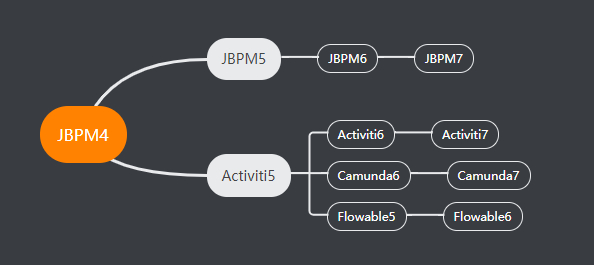
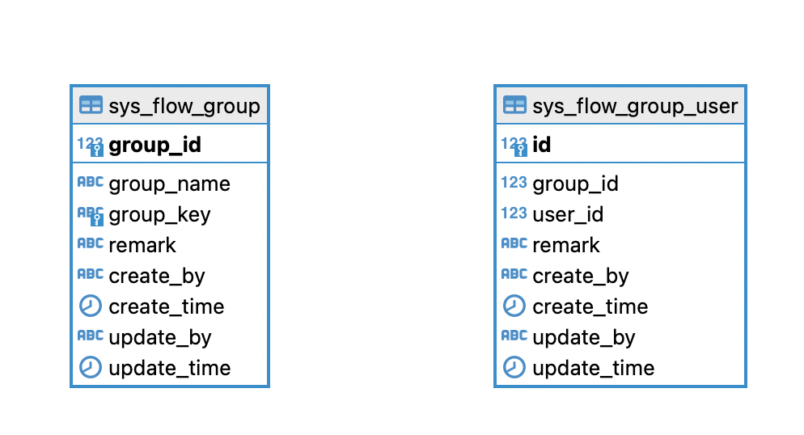
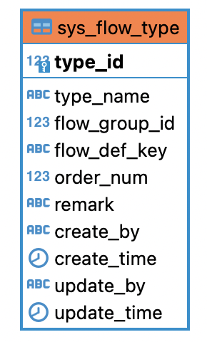
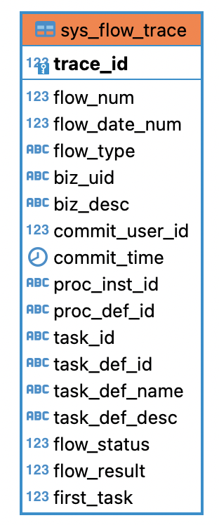
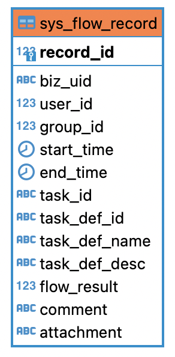
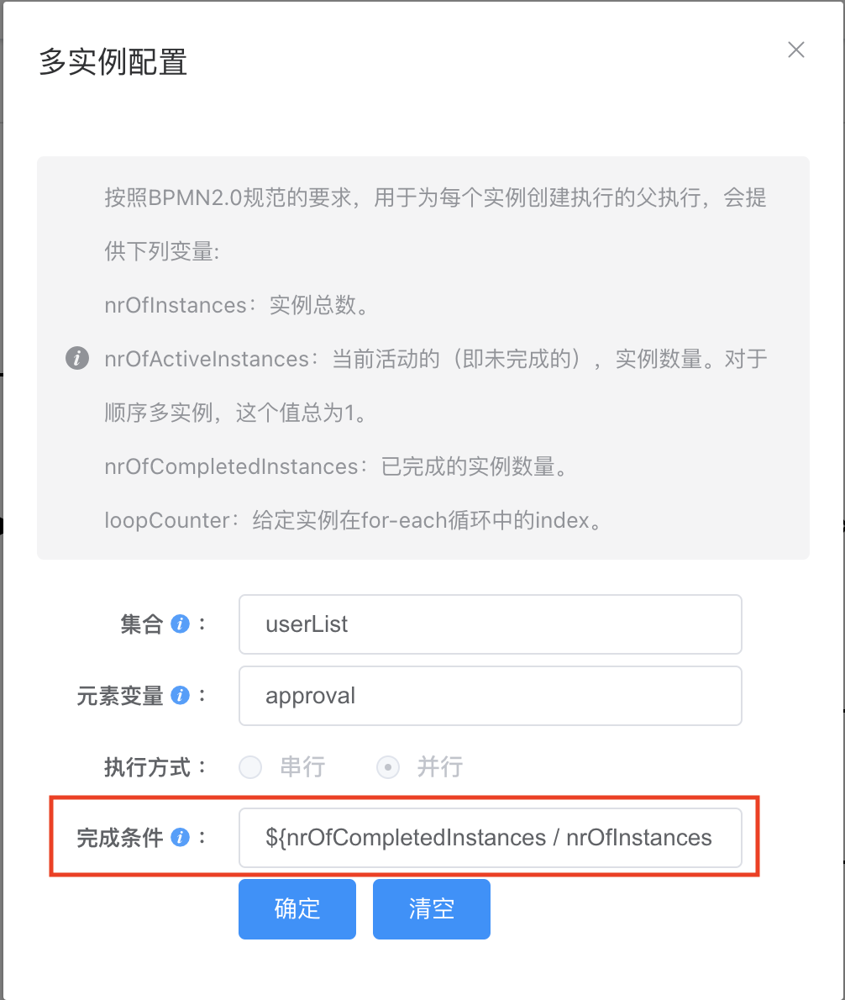

## 一. 框架简介

本框架基于精灵精灵开发框架，集成工作流引擎 [Flowable](https://www.flowable.com/open-source) 7.1.0。框架包含工作流涉及的组件，需要按文档集成到你现有的项目中，适用于进行过程中，需要集成工作流的项目。

**流程引擎的发展历史：**

目前主流的开源框架就是Activiti/Camunda/Flowable，它们都源自于jbpm。
先是有了jbpm4，随后出来了一个Activiti5，Activiti5经过一段时间的发展，核心人员出现分歧，又分出来了一个Camunda。
activiti5发展了4年左右，紧接着就出现了Flowable。



**BPMN协议：**

BPMN（Business Process Model and Notation）是一种业务流程建模和标记语言，用于描述和规划业务流程。BPMN被视为一种标准的业务流程建模语言，旨在帮助企业以一种可视化和易于理解的方式表示其业务流程。

BPMN协议提供了一种统一的图形表示方法，使企业能够更好地理解和分析其业务流程。它提供了一组图形符号，这些符号代表各种业务流程元素，如任务、网关、事件、流程、数据对象等。通过这些符号，企业可以更好地理解其业务流程的各个方面，从而更好地优化和管理其业务流程。

BPMN协议还提供了一种通用的方式来表示业务流程中的信息流动，这可以帮助企业更好地识别其业务流程中的瓶颈和问题，并提供改进的机会。因此，BPMN被广泛用于企业流程管理（BPM）和业务流程自动化（BPA）领域。

## 二. 集成插件

### 1. 下载插件

下载[工作流插件](https://github.com/dante7qx/springboot3-ruoyi/tree/func-integration)

### 2. 集成操作

解压下载后的文件。（可以将srt3-flowable 修改为 [项目]-flowable）

- 将`srt3-flowable`加入项目工程，并修改`pom.xml`

``` xml
<parent>
    <groupId>com.spirit</groupId>
    <artifactId>[项目]</artifactId>
    <version>5.0.0</version>
</parent>

<dependency>
    <groupId>com.spirit</groupId>
    <artifactId>[项目]-framework</artifactId>
</dependency>
```

- 修改项目根目录下的 `pom.xml`
``` xml
<dependencyManagement>
  <dependencies>
    <!-- 流程管理-->
    <dependency>
        <groupId>com.spirit</groupId>
        <artifactId>srt3-flowable</artifactId>
        <version>${project.version}</version>
    </dependency>
  </dependencies>
</dependencyManagement>

<modules>
  <module>srt3-flowable</module>
</modules>
```

- 修改`<项目>-admin`目录下的 `pom.xml`
``` xml
<dependencies>
  <!-- 流程管理-->
  <dependency>
      <groupId>com.spirit</groupId>
      <artifactId>srt3-flowable</artifactId>
  </dependency>
</dependencies>
```

- 修改 `application.yml`，添加配置

  注意： 当项目库中已经生成`flowable`相关表之后，将`database-schema-update`设置为`false`
``` yml
## 工作流配置
flowable:
  database-schema-update: true
  async-executor-activate: false
```

- 修改 `application-druid.yml`，修改配置
```yaml
## 修改 spring.datasource.druid.master.url，在最后添加配置
nullCatalogMeansCurrent=true
```

- 修改 `<项目>-common`下`BizModelConstants.java`
```java
/** 流程管理 */
public static final String SYS_FLOW = "SysFlow"; 
```

- 修改 `<项目>-framework`下`WebSocketMsg.java`
```java
/** 
 * 消息类型
 */
private String type;
```

- 添加前端依赖

``` bash
npm i vkbeautify
npm i form-gen-parser
npm i workflow-bpmn-modeler
npm i diagram-js
```

- 将`ui`下的文件加入到`[项目]-ui`模块下（已存在的文件进行覆盖）

  - 将`styles`文件夹复制到`[项目]-ui/src/assets`下
  - 将`Process`文件夹复制到`[项目]-ui/src/components`下
  - 将`generator`文件夹复制到`[项目]-ui/src/utils`下
  - 将`flowable`文件夹复制到`[项目]-ui/src/views`下
  - 将`api/flowable`文件夹复制到`[项目]-ui/src/api`下
  - 将`build`文件夹复制到`[项目]-ui/src/views/tool`下
  - 在`<项目>-ui/src/router/index.js`中，添加如下内容
    ``` js
    // export const constantRoutes 的最后，添加
    // 流程相关
    {
      path: '/flowable',
      component: Layout,
      hidden: true,
      children: [
        {
          path: 'definition/model',
          component: () => import('@/views/flowable/definition/model'),
          name: 'Model',
          meta: { title: '流程设计', activeMenu: '/flowable/definition' }
        }
      ]
    },
    {
      path: '/tool',
      component: Layout,
      hidden: true,
      children: [{
        path: 'build/index',
        component: () => import('@/views/tool/build/index'),
        name: 'FormBuild',
        meta: {
          title: '表单配置',
          icon: ''
        }
      }]
    }
    ```

- 执行数据库脚本 

  `sql/flowable-schema.sql`、`sql/flowable-data.sql`

## 三. 流程要素

一般情况下，业务审批流程包括以下要素：

- 审批流程设计：确定流程中的节点和步骤，并建立流程图或流程模型，以明确整个流程的执行过程。

- 角色和权限设置：确定各个参与方在流程中的角色和权限，以确保合适的人员参与到合适的步骤中。

- 流程表单设计：

  - 业务表单：基于业务，设计用户输入表单，一般用于流程发起阶段。

  - 审批表单：设计各种审批表单，以便参与方能够快速而准确地提交审批信息。

- 提交申请：提交审批请求，并提供所需的文档和信息。

- 审批过程：根据流程的设计，审批人员在系统中完成各个审批步骤，包括审批、转交、退回、会签等操作。

- 审批结果反馈：将审批结果及时反馈给申请人，包括审批通过或拒绝，以便后续流程的开展。

- 记录和日志：记录和日志是指保存和跟踪提交文档和审批过程的信息。记录和日志可以帮助提高透明度和合规性，并便于分析和改进审批流程


## 四. 设计说明

### 1. 流程数据库

- **流程组表（sys_flow_group、sys_flow_group_user）**
  
  用于管理流程过程中的参与者（之前使用角色），例如：部门负责人、人事专员。
  

- **流程类型表（sys_flow_type）**

  用于管理每个流程的类型，初始发起组、权重。例如：请假流程（普通请假、领导请假），根据发起人所在组的不同进行区分，如果发起人同时属于普通组和领导组，则根据权重来判定发起人最终采用那个流程。

  

- **流程跟踪表 (sys_flow_trace)**
  
  用于管理流程的提交人、提交时间、最新状态、审批结果。

  

- **流程记录表 (sys_flow_record)**

  用于记录整个流程的操作记录。
  
  


- **流程序号表 (sys_flow_seq)**

  存储流程的最大序号，当前设置了两个序号，自然序号和日期序号（**yyyyMMdd000001**）。

### 2. 业务数据库

  业务数据库设计原则，除了业务字段外，必须添加字段 `uid`。
  ``` sql
  uid varchar(64) not null comment '业务UID',
  ```
  ``` java
  String uid = IdUtil.nanoId();
  ```

### 3. 流程图

本框架屏蔽了大部分`Flowable`相关的编程，但流程图必须会进行绘制。

- 1. 需要选择下一步的审批人时

| 节点描述              | 说明                                                       |
| --------------------- | ---------------------------------------------------------- |
| G_groupKey            | 下一步审批人属于流程组groupKey                             |
| D_deptKey\|G_groupKey | 下一步审批人属于部门deptKey，流程组groupKey  (多个部门、流程组用逗号分隔，部门和流程组数量要一致)              |
| D\|G_groupKey         | 下一步审批人和当前处理人属于同部门，并且属于流程组groupKey |
| STARTER               | 下一步审批人是流程发起人（不支持多选）                     |

说明：对于下一步审批人为多选的情况，在节点描述后添加 |M

- 2. 节点Id

当某一个任务节点需要执行特定的业务逻辑时，可以自定义`节点Id`用于判断。

- 3. 人员配置

  - 申请（流程发起）人员：人员类型：指定人员、指定方式：动态、指定人员：`${INITIATOR}`

  - 审批人员：人员类型：候选人员、指定方式：动态、候选人员：`#{approval}`

- 4. 候选组

  人员类型：候选组、指定方式：固定、候选组：选择符合业务的流程组

- 5. 网关条件

  通过和退回的参数必须是`agree`，`${agree} 通过`、`${!agree} 退回`

- 6. 多实例

  用于设置会签操作，框架中只需要设置完成条件。

  

### 4. 业务详情

在`src/views/flowable/task/flowdetail.vue`下，通过`flowType`进行区分，例如：
``` vue
<el-tab-pane label="基本信息" name="info" lazy>
  <FlowDemo :key="key" :uid="bizUid" :pageCtl="pageCtl" :taskId="taskId" :procDef="procDef" @closeWindow="closeWindow" v-if="flowType == 'leave' && loadBizDetail" />
  <span v-else>无相关业务</span>
</el-tab-pane>
```

### 5. 流程事件提醒

流程处理过程中，可能需要处理一些业务逻辑，例如：短信提醒、业务更新等。为了解决这些需求，框架采用事件驱动的方式，对流程和业务进行解耦。

当发起、审批流程后，框架会发送事件消息，代码如下：

``` java
// 发布流程事件消息
sysFlowEventPublisher.publish(buildEvent(taskVo, curTasks));
```

相关业务操作，在事件监听器处进行处理，代码如下

``` java
public class SysFlowEventListener {
	
    @Order
	@EventListener(SysFlowEvent.class)
	public void handleSysFlowEvent(SysFlowEvent<SysFlowEventBody> event) {
		SysFlowEventBody sysFlowBody = (SysFlowEventBody) event.getSource();
		log.debug("流程事件消息 {}", sysFlowBody);
		SysFlowTypeEnum.fromType(sysFlowBody.getFlowType()).notice(sysFlowBody);
		
	}
	
	// 处理逻辑在 SysFlowMsgNoticeServiceImpl.java 
}
```

前端集成`WebSocket`, 页面在 `<项目>-ui/src/layout/components/`下

```js
data() {
  return {
    ws: null,
    noticeType: { // 提醒类型: key - path
      'SysFlow': ['待办任务', 'flowabletask/flowTodo']
    }
  }
},

methods: {
  async logout() {
    this.$confirm('确定注销并退出系统吗？', '提示', {
      confirmButtonText: '确定',
      cancelButtonText: '取消',
      type: 'warning'
    }).then(() => {
      if (this.ws) {
        this.ws.close();
        this.ws = null;
      }
      this.$store.dispatch('LogOut').then(() => {
        location.href = this.$router.options.base === "/" ? "/index" : this.$router.options.base + '/index'
      })
    }).catch(() => {});
  },
  connWS() {
    const user = this.$store.state.user
    if(user == null) {
      return;
    }
    const { host } = location
    const wsuri = `ws://${host}${process.env.VUE_APP_SOCKET_BASE_API}/websocket/message/${user.name}`;
    this.ws = new WebSocket(wsuri);
    const self = this;
    this.ws.onopen = function (event) {
      console.log('已建立WebSocket连接！')
    };
    this.ws.onmessage = function (event) {
      self.notifyUser(event.data)
    };
    this.ws.onclose = function (event) {
      console.log('已关闭WebSocket连接！')
    };
  },
  notifyUser(msg) {
    const data = JSON.parse(msg)
    const that = this
    this.$notify({
      title: data.title,
      type: 'warning',
      iconClass: 'el-icon-info',
      message: data.content,
      duration: 0, // 不会自动关闭
      onClick() {
        this.close()
        that.handleNotifyClick(data)
      }
    });
  },
  handleNotifyClick(data) {
    // 按项目需求实现相关业务逻辑
    const openTab = this.noticeType[data.type]
    this.$tab.openPage(openTab[0], openTab[1]);
  }
}
```

### 6. 业务实现方法

- 删除流程：每个业务根据流程类型实现相关删除。
  
  业务类要实现 `ISysFlowBizService.java` 接口
  ```java
  /**
   * 根据 uid 删除业务数据
   * 
   * @param uid
   */
  int deleteBizByUid(String uid);
  ```

  删除入口`com.spirit.flowable.service.impl.SysFlowTaskServiceImpl`下
  ``` java
  @Override
  @Transactional
  public int delete(SysFlowTaskVo sysFlowTaskVo) {
      // 策略 + 枚举
      SysFlowTypeEnum.fromType(sysFlowTaskVo.getFlowType()).deleteBizByUid(sysFlowTaskVo.getBizUid()); // 删除业务数据
      if (StrUtil.isNotEmpty(sysFlowTaskVo.getProcInstId())) {
          deleteFlowByProcInstId(sysFlowTaskVo.getProcInstId());
      }
      sysFlowAssignMapper.deleteSysFlowAssignByProcInstId(sysFlowTaskVo.getProcInstId());
      sysFlowRecordService.deleteSysFlowRecordByBizUid(sysFlowTaskVo.getBizUid());
      return sysFlowTraceService.deleteSysFlowTraceByBizUid(sysFlowTaskVo.getBizUid());
  }
  ```

## 五、适用场景

### 1. 适用场景

适用于流程定义、会签、会签一票否决、退回（逐级、跨级）、候选审批人、候选审批组、流程版本、历史记录。

### 2. 不适用场景

暂不支持加签、减签、转办。

## 六、示例运行

### 1. 执行SQL

``` sql
INSERT INTO sys_flow_group (group_name,group_key,create_by,create_time) VALUES
('普通员工','GK_CN','fqyczadmin', sysdate()),
('部门领导','CK_BMLD','fqyczadmin', sysdate()),
('专员','GK_ZY','fqyczadmin', sysdate()),
('统管领导','GK_TGLD','fqyczadmin', sysdate()),
('Boss层','GK_BOSS','fqyczadmin', sysdate());
```

### 2. 导入流程图
`sql\普通员工请假.bpmn20.xml`、`sql\领导请假.bpmn20.xml`

### 3. 页面上配置流程类型

在`流程管理` ——> `流程类型` 下进行设置。

### 4. 代码参考

- 后端：`com.spirit.flowable.demo` 包下

- 前端： `src/views/flowable/demo/flowdemo.vue`
