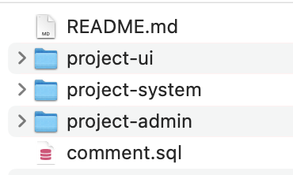

框架添加了留言评论的功能，主版本精灵框架已包含此功能，老版本框架若要使用，请进行如下操作，集成功能:

## 一. 下载源码

下载留言评论插件。

## 二. 组件集成

解压下载后的文件，看到如下结构：



### 1. [项目]-system

将`[project-system]`下的文件复制到您`[项目]-system`下对应的目录中。

### 2. [项目]-admin

- 将`[project-admin]/SysCommentController.java`复制到您`[项目]-admin`下`com.spirit.web.controller.system`包下。

- 修改`CommonController.java`，添加如下代码：

``` java
private static final String THUMBNAIL_PREFIX = "thumbnail_";

...

/**
 * 上传图片同时生成缩略图
 */
@PostMapping("/upload_img_with_thumb")
public AjaxResult uploadImgWithThumb(MultipartFile file) throws Exception {
    try {
        // 上传文件路径
        String profile = RisunConfig.getProfile();
        String filePath = RisunConfig.getUploadPath();
        // 上传并返回新文件名称
        String fileName = FileUploadUtils.upload(filePath, file);
        String url = serverConfig.getUrl() + fileName;
        String source = profile.concat(StringUtils.substringAfter(fileName, Constants.RESOURCE_PREFIX));
        String target = source.replaceAll(FileUtils.getName(fileName), THUMBNAIL_PREFIX.concat(FileUtils.getName(fileName)));
        String thumbnailName = fileName.replaceAll(FileUtils.getName(fileName), THUMBNAIL_PREFIX.concat(FileUtils.getName(fileName)));
        // 生成缩略图
        ImgUtil.scale(new File(source), new File(target), 0.5f);
        AjaxResult ajax = AjaxResult.success();
        ajax.put("url", url);
        ajax.put("fileName", fileName);
        ajax.put("newFileName", FileUtils.getName(fileName));
        ajax.put("originalFilename", file.getOriginalFilename());
        ajax.put("thumbnailName", thumbnailName);
        return ajax;
    } catch (Exception e) {
        return AjaxResult.error(e.getMessage());
    }
}

```

### 3. [项目]-ui

- 将`[project]-ui`下的文件复制到您`[项目]-ui`对应的目录下
  - 将`like.svg`复制到`src/assets/icons/svg`下
  - 将`comment.js`复制到`src/api/system`下
  - 将`play.vue`复制到`src/components/Video`下
  - 将`Comment文件夹`复制到`src/components`下

- 修改`[项目]-ui`下`main.js`

``` javascript
// 删除
import VideoPlayer from '@/components/Video'

// 添加
import VideoMonitor from '@/components/Video'
import VideoPlayer from '@/components/Video/play'

Vue.component('VideoMonitor', VideoMonitor)
```

### 4. 数据库添加留言评论表

在您的项目中，执行 `comment.sql`

## 三. 使用说明

### 1. 属性

``` javascript
props: {
  // 业务模块
  bizModel: {
    type: String,
    required: true
  },
  // 业务主键
  bizId: {
    type: Number,
    required: true
  },
  // 评论是否可上传图片
  showImg: {
    type: Boolean,
    required: false,
    default: false
  },
  imgFileSize: {
    type: Number,
    required: false,
    default: 1  // 图片大小，默认1Mb
  },
  // 评论是否可上传视频
  showVideo: {
    type: Boolean,
    required: false,
    default: false
  },
  videoFileSize: {
    type: Number,
    required: false,
    default: 8  // 视频大小，默认8Mb
  }
}
```

### 2. 使用

``` javascript
<comment :bizModel="'demo'" :bizId="100" />

<comment :bizModel="'demo'" :bizId="100" :showImg="true"/>

<comment :bizModel="'demo'" :bizId="100" :showImg="true" :showVideo="true"/>
```

