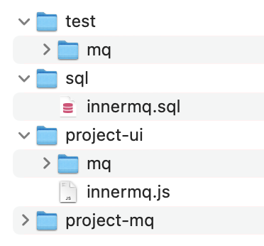
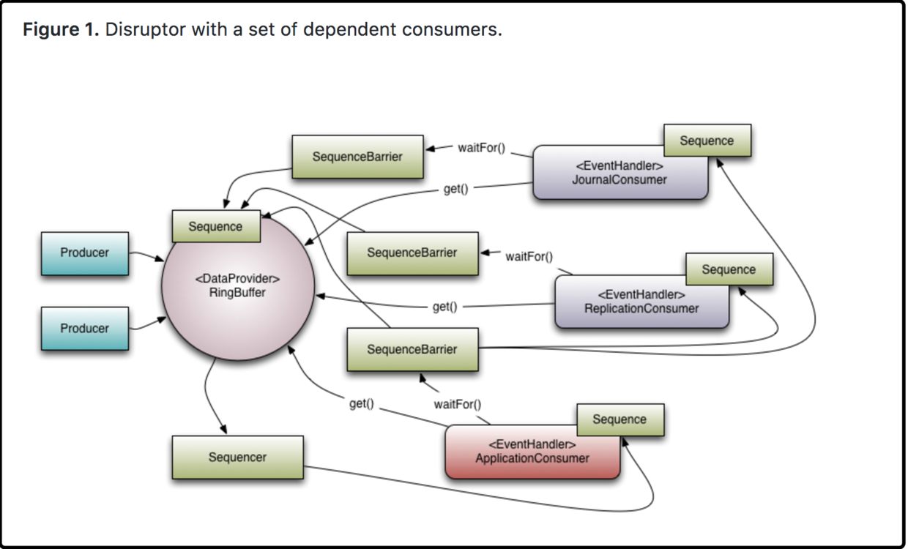
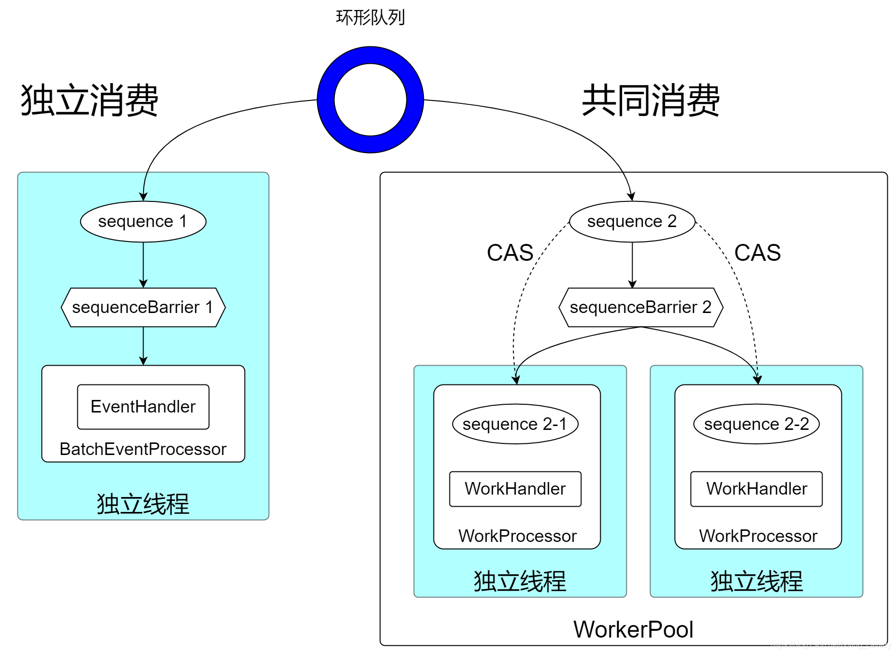

框架添加了内部消息队列的功能，主版本精灵框架已包含此功能，老版本框架若要使用，请进行如下操作，集成功能:

## 一. 下载源码

下载内部消息队列插件。

## 二. 插件集成



### 1. [项目]-mq

将`[srt3-mq]`模块添加到您的项目中，按项目修改`pom.xml`

```xml
<artifactId>[按项目修改srt3]-mq</artifactId>

<!-- 通用工具-->
<dependency>
  <groupId>com.spirit</groupId>
  <artifactId>[按项目修改srt3]-framework</artifactId>
</dependency>
```

### 2. [项目]-ui

- 将`mq`目录复制到`[项目]-ui/src/views/monitor`下
- 将`innermq.js`复制到`[项目]-ui/src/api/monitor`下

### 3. 执行SQL

在你的项目中，执行`sql/innermq.sql`

### 4. 测试（可选）

`test/mq`下的文件是测试代码，若要进行测试，需进行如下操作：

- 修改`[项目]-admin/pom.xml`
``` xml
<!-- 核心模块 -->
<dependency>
    <groupId>com.spirit</groupId>
    <artifactId>[项目]-framework</artifactId>
</dependency>

// 修改为
<!-- 消息队列 -->
<dependency>
    <groupId>com.spirit</groupId>
    <artifactId>[项目]-mq</artifactId>
</dependency>
```

- 将`test/mq`下的文件复制到`[项目]-admin/src/test/java/com/spirit`目录下

## 三. 业务开发

使用内部消息队列来处理业务需求，需要编写如下代码。这里以创建订单后，给客户发送短信、邮件为例。

假设已有业务类：`Order.java` `OrderService.java` `SmsService.java` `MailService.java`

需要编写如下类：`OrderInnerMQService.java` `SmsConsumerHandler.java` `MailConsumerHandler.java`

<details>
  <summary>SmsConsumerHandler.java (短信消费者)</summary>

  ``` java
  /**
   * 短信消费者
   */
  public class SmsConsumerHandler implements IndependentComsumer<Order> {

      private final SmsService smsService;

      public SmsConsumerHandler(SmsService smsService) {
          this.smsService = smsService;
      }

      @Override
      public void onEvent(InnerMQEvent<Order> event, long sequence, boolean endOfBatch) throws Exception {
          // 必须写上这一句
          event.setConsumerClass(SmsConsumerHandler.class.getName());
          // 短信Service发送短息
          smsService.sendSms(event);
      }
  }
  ```
</details>
<br/>
<details>
  <summary>MailConsumerHandler.java (邮件消费者)</summary>

  ``` java
  /**
   * 邮件消费者
   */
  public class MailConsumerHandler implements IndependentComsumer<Order> {
    
      private final MailService mailService;

      public MailConsumerHandler(MailService mailService) {
        this.mailService = mailService;
      }

      @Override
      public void onEvent(InnerMQEvent<Order> event, long sequence, boolean endOfBatch) throws Exception {
          // 必须写上这一句
          event.setConsumerClass(MailConsumerHandler.class.getName());
          // 邮件Service发送邮件
          mailService.sendMail(event);
      }
  }
  ```
</details>
<br/>
<details>
  <summary>OrderInnerMQService.java (订单消息队列服务类)</summary>

  ``` java
  /**
   * 订单消息队列服务类（发布消息以及设置消费者处理方式）
   */
  @Service("orderInnerMQService")
  public class OrderInnerMQService extends InnerMQService<Order> {
    
      @Autowired
      private SmsService smsService;

      @Autowired
      private MailService mailService;

      @Override
      protected void bizConsume() {
          // 指定短信消费者和邮件消费者来处理订单
          innerMQ.handleEventsWith(new SmsConsumerHandler(smsService), new MailConsumerHandler(mailService));
      }
  }
  ```
</details>
<br/>
<details>
  <summary>OrderService.java (已存在，填写消息队列逻辑)</summary>

  ``` java
  /**
   * 订单服务类
   */
  public class OrderService {

      @Autowired
      @Qualifier("orderInnerMQService")
      private InnerMQService orderInnerMQService;
    
      /**
       * 创建订单
       */
      public void createOrder() {
          // 创建订单
          Order order = 创建好的订单
          // 发布订单消息
          InnerMQEvent<Order> event = new InnerMQEvent<>();
          event.setPayload(order);
          orderInnerMQService.publish(event);
      }
  }
  ```
</details>

## 四. 异常补偿机制

内部消息队列中，所有对消息的操作都是在内存中进行的，所以在业务逻辑中处理消息出现异常时，该消息就无法再被消费处理，这样有时会导致业务逻辑的不完整。

例如：客户消费后，系统会创建订单、增加客户积分。创建订单时发布消息，增加客户积分接收消息进行处理。当增加客户积分操作出现异常时，该客户的积分就没有增加。

为了解决这个问题，框架采用事后补偿机制来确保一次交易的一致性，业务消费消息出现异常时，消息会持久化到 `sys_inner_mq_exception` 表中，业务通过该表进行业务处理。

## 五. 技术说明

内部消息队列功能是基于开源并发框架[Disruptor](https://lmax-exchange.github.io/disruptor)实现的。其作用和阻塞队列(BlockingQueue)类似，都是在相同进程内、不同线程间传递数据(例如消息、事件)，另外disruptor也有自己的一些特色：

- 以广播的形式发布事件，并且消费者之间存在依赖关系；
- 为事件提前分配内存；
- 无锁算法；



- 消费模式，包括独立消费和共同消费两种。

  例如：每产生一个订单都要发邮件和短信通知买家，如果产生了十个订单，要发十封邮件和十条短信，此时，邮件系统和短信系统是各自独立的，他们各自消费这十个订单的事件。
假设邮件系统处理能力差，为了提升处理能力，部署了两台邮件服务器，因此是这两台邮件服务器共同处理十个订单事件，合起来一共发送了十封邮件，一号邮件服务器和二号邮件服务器是共同消费。


