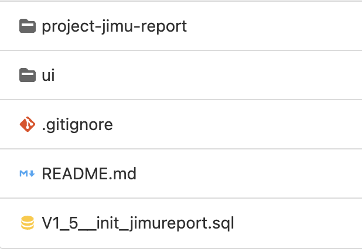

> 待完善，不可用于生产环境。

框架添加了在线Excel报表设计功能，基于积木报表进行二次开发。若要使用此功能，请进行如下操作，集成功能:

## 一. 下载源码

下载在线Excel报表设计插件。

## 二. 插件集成



### 1. [项目]-jimu-report

将`[srt3-jimu-report]`模块添加到您的项目中，按项目修改`pom.xml`

```xml
<module>[按项目修改srt3]-jimu-report</module>
```

```xml
<artifactId>[按项目修改srt3]-jimu-report</artifactId>

<!-- 通用工具-->
<dependency>
  <groupId>com.spirit</groupId>
  <artifactId>[按项目修改srt3]-framework</artifactId>
</dependency>
```

### 2. ui

- 将`view/jimureport`目录复制到`[项目]-ui/src/views/`下
- 将`api/jimureport`复制到`[项目]-ui/src/api/`下

### 3. 执行SQL

两种方式

1. 手动执行`db.sql`

2. 通过框架数据库版本管理功能自动执行（将`db.sql`放到`[项目]-admin/src/main/resources/db/migration/`下）

### 4. 替换积木报表jar包

> 待完善

下载二次开发后的`jar包`，替换本地的依赖包。

本地依赖包默认位于：

`~/.m2/repository/org/jeecgframework/jimureport/jimureport-spring-boot-starter/1.5.8/`

### 5. 框架修改

检查框架中的三个类`Constants.java`、`SecurityConfig.java`、`TokenService.java`，若没有相应的代码，需要进行如下修改

`Constants.java` 添加
``` java
/** 
 * 积木报表
 */
public static final String JIMU_TOKEN = "X-Access-Token";
public static final String JIMU_PREFIX = "jmreport";
public static final String JIMU_STATIC = "desreport_";
```

`SecurityConfig.java` 添加
``` java
// 积木报表静态资源、报表分享，可匿名访问
.antMatchers("/jmreport/desreport_/**", "/jmreport/img/**", "/jmreport/shareView/**", "/jmreport/share/verification/**",
				"/jmreport/addViewCount/**", "/jmreport/show/**", "/jmreport/getQueryInfo/**", "/jmreport/upload").permitAll()
```

`TokenService.java` 
``` java

// String token = request.getHeader(header);  修改为

String token = StrUtil.isNotEmpty(request.getHeader(header)) ? request.getHeader(header) : getJimuReportToken(request);

// 新增方法

/**
 * 获取积木报表请求token
 * 
 * @param request
 * @return
 */
private String getJimuReportToken(HttpServletRequest request) {
    String token = "";
    String uri = request.getRequestURI();
    
    if(StrUtil.startWith(uri, "/".concat(Constants.JIMU_PREFIX)) && !StrUtil.contains(uri, Constants.JIMU_STATIC)) {
        token = request.getParameter(Constants.TOKEN);
        if(StrUtil.isEmpty(token)) {
          token = request.getHeader(Constants.JIMU_TOKEN);
        }
    }
    return token;
}

/**
 * 获取用户身份信息
 *
 * @return 用户信息
 */
public LoginUser getLoginUser(String token) {
    if (StrUtil.isNotEmpty(token)) {
      try {
          Claims claims = parseToken(token);
          // 解析对应的权限以及用户信息
          String uuid = (String) claims.get(Constants.LOGIN_USER_KEY);
          String userKey = getTokenKey(uuid);
          LoginUser user = redisCache.getCacheObject(userKey);
          return user;
        }
        catch (Exception e) {
        }
    }
    return null;
}
```

### 6. 修改`application.yml`

在最后添加配置：

```yaml
## 积木报表配置
jeecg: 
  jmreport: 
    pageSize:
      - 10
      - 20
      - 30
      - 40
      - 50
    customPrePath: /dev-api
  uploadType: local
  path: 
    upload: ${spirit.profile}/report
```

## 三. 设计说明

### 1. 权限设计

只有系统管理和报表专员（report_specialist）可以进行报表设计。

| 人员（角色）      | 查询                             | 新增报表 | 编辑报表 | 复制模板 | 模板设置 | 数据字典 |
| ----------------- | -------------------------------- | -------- | -------- | -------- | -------- | -------- |
| 系统管理员        | 所有报表                         | 有       | 有       | 有       | 有       | 有       |
| 报表专员（角色 ） | 自己创建和所在部门拥有权限的报表 | 无       | 有       | 有       | 无       | 无       |
| 普通员工          | 所在部门拥有权限的报表           | 无       | 无       | 无       | 无       | 无       |

### 2. 数据字典

- 可以从系统数据字典中进行同步，相同的字典类型同步后会覆盖。
- 可以根据业务需求自定义字典，不影响系统数据字典。

### 3. 菜单设置
