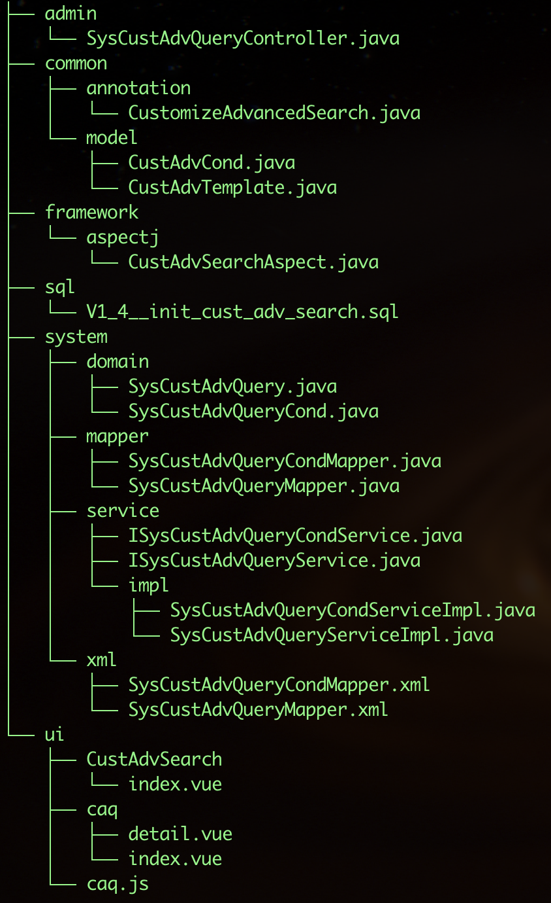

框架添加了自定义高级查询的功能，主版本精灵框架已包含此功能，老版本框架若要使用，请进行如下操作，集成功能:

## 一. 下载源码

下载自定义高级查询插件。



## 二. 插件集成

### 1. [项目]-system

将 `system` 目录下的`domain、mapper、service`复制到你的`[项目]-system`中

`xml`中文件复制到`[项目]-system/src/main/resources/mapper/system`中

### 2. [项目]-common

将 `common` 目录下的文件复制到你`[项目]-common`对应的目录中

### 3. [项目]-framework

将 `framework` 目录下的文件复制到你`[项目]-framework`对应的目录中

### 4. [项目]-admin

将 `admin` 目录下的文件复制到你`[项目]-admin/src/main/java/com/spirit/web/controller/system`中

### 5. [项目]-ui

将 `ui` 目录下的文件复制到你`[项目]-ui`对应的目录中

- `CustAdvSearch/`  ——>  `src/components/`

- `caq/`            ——>  `src/views/system/`

- `caq.js`         ——>  `src/api/system/`

### 6. 添加全局组件

在 main.js 中添加如下内容

``` javascript
// 自定义高级查询组件
import CustAdvSearch from '@/components/CustAdvSearch'
...
Vue.component('CustAdvSearch', CustAdvSearch)
```

### 7. 执行SQL

在你的项目中，执行`sql/V1_4__init_cust_adv_search.sql`

## 三. 使用说明

### 1. 添加注解

在`Controller`中，查询列表方法上添加注解`@CustomizeAdvancedSearch`，例如: 
``` java
@GetMapping("/list")
@CustomizeAdvancedSearch
public TableDataInfo list(Xx xx) {
    startPage();
    List<Xx> list = xxService.selectXxList(xx);
    return getDataTable(list);
}
```

### 2. Mybatis XML

在`Mybatis XML`中，查询列表的sql中，添加如下代码: 
``` xml
<!-- 自定义高级查询 -->
<if test="params.customizeAdvanced != null and params.customizeAdvanced != ''"> 
    ${params.customizeAdvanced} 
</if>
<!-- 自定义高级查询 -->
```
例如: 
``` xml
<select id="selectXxList" parameterType="Xx" resultMap="XxResult">
    ...
    <where>  
        <if test="xx != null  and xx != ''"> and t.xx = #{xx}</if>

        <!-- 自定义高级查询 -->
        <if test="params.customizeAdvanced != null and params.customizeAdvanced != ''"> 
            ${params.customizeAdvanced} 
        </if>
        <!-- 自定义高级查询 -->
    </where>
</select>
```
>注意：必须为数据库表添加别名，例如: `select t.id from t_xx t`

### 3. 前端使用组件

``` javascript

<!-- 查询按钮 -->
<el-button type="success" icon="el-icon-zoom-in" size="mini" @click="openCustAdvSearch">高级查询</el-button>

<!--自定义高级查询组件 -->
<!-- 
  tableName: 数据库表名
  tableAlias: 数据库表别名
  searchFunc: 回调查询方法
-->
<cust-adv-search v-if="showCustAdvSearch" :tableName="'t_demo'" :tableAlias="'t'" :searchFunc="customSearch"/>

<!-- 自定义查询标识 -->
data() {
  return {
    ...
    // 打开自定义查询
    showCustAdvSearch: false
  }
}

<!-- 自定义查询方法 -->
methods: {
  openCustAdvSearch() {
    this.showCustAdvSearch = false;
    setTimeout(() => { this.showCustAdvSearch = true; }, 0)
  },
  customSearch(key, params) {
    this.queryParams.pageNum = 1;
    this.queryParams.params[key] = params;
    this.getList();
  }
}
```

### 4. Demo示例

Demo示例，可参考：`src/views/biz/demo/index.vue`