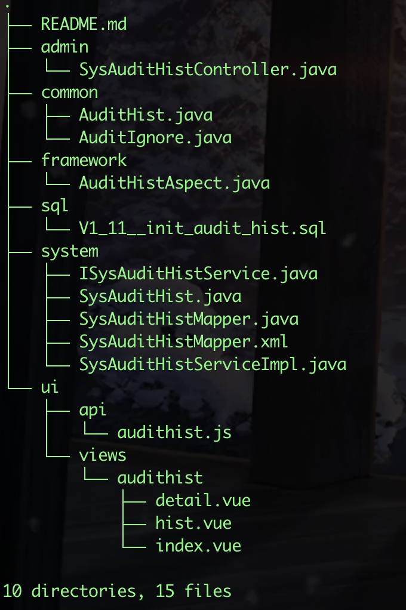

框架添加了审计历史的功能，主版本精灵框架已包含此功能，老版本框架若要使用，请进行如下操作，集成功能:

## 一. 下载源码

下载[审计历史](https://github.com/dante7qx/springboot3-ruoyi/tree/func-integration/audithist-plugin)插件。



## 二. 插件集成

### 1. system

将 `system` 目录下的`domain、mapper、service`复制到你的`[项目]-system`中

`xml`中文件复制到`[项目]-system/src/main/resources/mapper/system`中

### 2. common

将 `common` 目录下的文件复制到你`[项目]-common`对应的目录中

### 3. framework

将 `framework` 目录下的文件复制到你`[项目]-framework`对应的目录中

### 4. admin

将 `admin` 目录下的文件复制到你`[项目]-admin/src/main/java/com/spirit/web/controller/monitor`中

### 5. ui

将 `ui` 目录下的文件复制到你`[项目]-ui`对应的目录中

- `views/audithist`  ——>  `src/views/monitor/`

- `caq.js`         ——>  `src/api/monitor/`

### 6. 执行SQL

在你的项目中，执行`sql/V1_11__init_audit_hist.sql`

### 7. 修改`BaseEntity.java`

```java
/** 搜索值 */
@AuditIgnore
private String searchValue;

/** 请求参数 */
@AuditIgnore
private Map<String, Object> params;
```

## 三. 使用说明

### 1. 添加注解

在`Service`中，新增、修改、删除方法上添加注解`@AuditHist(bizClazz = Demo.class, op = BusinessType.INSERT)`，例如: 
``` java
@Override
@AuditHist(bizClazz = Demo.class, op = BusinessType.INSERT)
public int insertDemo(Demo demo) {
    demo.setCreateBy(SecurityUtils.getUsername());
    demo.setCreateTime(DateUtils.getNowDate());
    return demoMapper.insertDemo(demo);
}
```

### 2. 忽略审计

若某些字段不需要进行审计，可以在字段上添加注解 `@AuditIgnore`

### 3. Demo示例

Demo示例，可参考：`src/views/biz/demo/index.vue`
