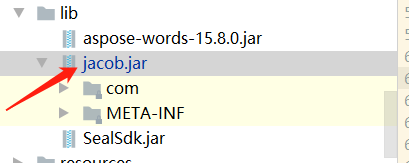

## 一. 概述

基于jacob的word转pdf

## 二. Word转Pdf

1.项目中引入jacob，如下：
  -
    <dependency>
          <groupId>com.jacob</groupId>
          <artifactId>jacob</artifactId>
          <version>1.20</version>
          <scope>system</scope>
      <systemPath>${project.basedir}/src/main/lib/jacob.jar</systemPath>
     </dependency>
    
  2.代码如下：
 - 
          public static String wordToPdfPath(String wordFile, String fileName) {
           // 获取资源路存储路径
           //String localPath = "D:\\ruoyi\\kjxm-pl\\uploadPath";
           String localPath = RuoYiConfig.getProfile();
           String formatSuffix = ".pdf";
           // 拼接后的文件名
           fileName = fileName + formatSuffix;
           String pdfPath = localPath + File.separator + "upload" + File.separator + fileName;
           ActiveXComponent app = null;
           // 开始时间
           log.info("转换开始时间：{}", DateUtils.getDate());
           try {
               // 打开word
               app = new ActiveXComponent("Word.Application");
               // 获得word中所有打开的文档
               Dispatch documents = app.getProperty("Documents").toDispatch();
   
               // 打开文档
               Dispatch document = Dispatch.call(documents, "Open", wordFile, false, true).toDispatch();
               // 如果文件存在的话，不会覆盖，会直接报错，所以我们需要判断文件是否存在
               File target = new File(pdfPath);
               if (target.exists()) {
                   target.delete();
               }
               log.info("打开文档: ", DateUtils.getDate());
               Dispatch.call(document, "SaveAs", pdfPath, 17);
               // 关闭文档
               Dispatch.call(document, "Close", false);
               log.info("另存为: ", DateUtils.getDate());
           } catch (Exception e) {
               e.printStackTrace();
               log.info("转换失败:", e.getMessage());
           } finally {
               // 关闭office
               if(app != null) {
                   app.invoke("Quit", 0);
               }
               log.info("关闭office");
               //ComThread.Release();
           }
           return pdfPath;
       }
   
       public static void main(String[] args) {
           String wordFile="D:\\..\\uploadPath\\download\\word.doc";
           String pdf="newpdf";
           System.out.println(wordToPdfPath(wordFile,pdf));
       }
	
## 三. 常见问题

- 解决jacob 部署到服务器上后无法进行文档转换的问题

1. windows电脑安装word。

2. com.jacob.com.ComFailException: VariantChangeType failed,解决方案如下:
 -  在C:\Windows\System32\config\systemprofile下创建文件夹Desktop;

3. 计算机的com交互组件没有启用. 解决方案如下:
- （1） 运行命令： mmc comexp.msc -32
- （2） 找到：组建服务>计算器>我的计算机>DCOM组件>Microsoft Word 97-2003 文档；
- （3） 右键点击，选择属性，修改标识为“交互式用户”，点击“确定”；

4. 在system32下面放入对应的dll文件,版本跟jacob.jar的版本对应好/
 
5. 在C:\Windows\System32目录下添加jacob-1.20-x64.dll

6. 在C:\Windows\SysWOW64目录下添加jacob-1.20-x64.dll

7. jacob.jar和jacob.dll目录如下：
 - (1)jacob.jar 放在 C:\Program Files\Java\jdk1.8.0_171\jre\lib\ext目录下 --jacob.jar
 - (2)jacob*.dll 放在 C:\Program Files\Java\jdk1.8.0_171\jre\bin 目录下--jacob-1.20-x64.dll

8. 项目中jacob位置
 - 

9. 其中7,8中的jacob版本一致

## 四. 参考资料
  
- https://www.cnblogs.com/gj1990/p/7991889.html

