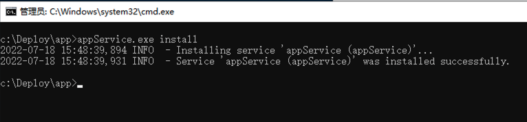
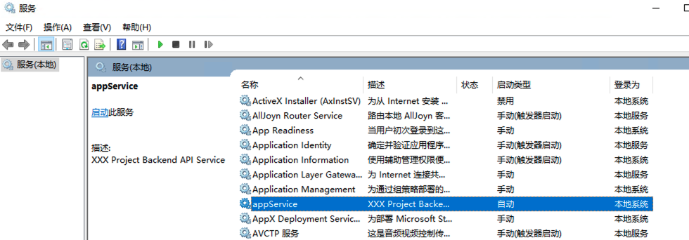
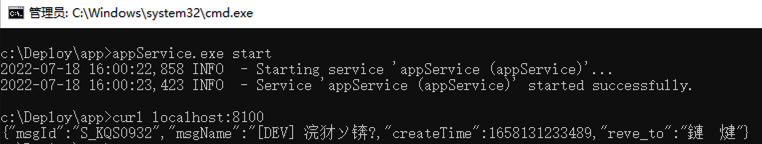

## 一. 环境准备

::: tip
- 服务器必须是云主机，并且要和Jenkins Master服务器网络互通
- 服务器要加入到Jenkins集群中
- 服务器上要事先安装 JDK1.8、Maven3.6+、Node16+，并加入到系统的PATH中
- 若要部署前端页面，须事先安装nignx，并做好配置
:::

## 二. 服务化部署

统一将项目的后台API服务以Windows系统服务的方式，来部署运行。

### 1. 提供健康检查Endpoint
在项目中提供健康检查Endpoint，可匿名访问，例如
``` java
public class DemoController {
    @GetMapping("/health_check")
    public String healthCheck() {
      return "UP";
    }
}

// 在SecurityConfig.java中设置匿名访问
.antMatchers("/health_check").anonymous()
```

### 2. 下载WinSw

WinSw是一个可以将任何应用程序注册成服务的软件，可以在<a href="https://github.com/winsw/winsw/releases" target="_blank">Github</a>中进行下载，<a href="https://github.com/winsw/winsw/releases/download/v2.11.0/WinSW-x64.exe" download="winsw">点击下载</a>

### 3. 部署后台API

在系统中创建一个目录用来进行部署，本文档中该目录为 `C:\Deploy`

1. 创建项目目录（本例中项目为app）

   进入`C:\Deploy`，创建app文件夹

2. 创建服务

   进入`C:\Deploy\app`目录，创建文件夹logs、files、apikeys

- 将项目后台API服务的 jar 包放到该目录下，本例为 app.jar

- 将`WinSW-x64.exe`复制到 `C:\Deploy\app` 下，并重命名为`appService.exe`

- 服务配置，创建appService.xml，内容如下
``` xml
<service>
  <id>appService</id>
  <name>appService</name>
  <description>XXX Project API Service</description>
  <logpath>%BASE%\logs</logpath>
  <log mode="roll-by-size">
    <sizeThreshold>10240</sizeThreshold>
    <keepFiles>8</keepFiles>
  </log>
  <executable>java</executable>
  <arguments>
    -Xms1024m -Xmx1024m -XX:MetaspaceSize=128m -XX:MaxMetaspaceSize=128m
    -Dfile.encoding=utf-8
    -Djava.security.egd=file:/dev/./urandom
    -jar "%BASE%\app.jar"
    --server.port=8100
    --ruoyi.profile="%BASE%\files"
    --ruoyi.apiKey="%BASE%\apikeys"
    --spring.redis.host="127.0.0.1"
    --spring.redis.port=6379
    --spring.redis.password= 
    ... <其他项目配置>
  </arguments>
</service>
```

- 使用cmd，用cd命令转到`C:\Deploy\app`
  - 执行命令安装服务 `appService.exe install` 

  
  - 查看系统服务

  
  - 执行命令启动服务 `appService.exe start` 


``` powershell
:: 命令说明
:: 安装服务命令
appService.exe install

:: 卸载服务命令
appService.exe uninstall

:: 启动服务命令
appService.exe start

:: 停止服务命令
appService.exe stop

:: 重新启动服务命令
appService.exe restart
```

### 4. 部署前端页面

- 在 `C:\Deploy\app` 下，创建文件夹 html

- 将前端构建后的文件放到 html 目录下

- 将nginx中配置 Location root，修改为 C:\Deploy\app\html

```NGINX
server {                                                                                                                                                                                        
    listen       8100;
    server_name  localhost;
 
    location / {
		root  E:/deploy/srt3-xx/html;
		try_files $uri $uri/ /index.html last;
		index  index.html index.htm;
    }
	
	location /prod-api/{
			proxy_set_header Host $http_host;
			proxy_set_header X-Real-IP $remote_addr;
			proxy_set_header REMOTE-HOST $remote_addr;
			proxy_set_header X-Forwarded-For $proxy_add_x_forwarded_for;
			proxy_pass http://localhost:8120/;
			client_max_body_size  200m;
	}
	
	location /srt3-xx-profile{
        alias E:/deploy/srt3-xx/files;
        autoindex on;
    }
}
```

- 启动 nginx

### 5. 批处理脚本

- 在 `C:\Deploy\app` 下，创建 `deploy.bat`，内容如下
``` powershell
:: 后端API
C:
cd C:\Deploy\app
appService.exe stop
timeout /T 3 /NOBREAK
del app.jar
move new_app.jar app.jar
appService.exe start

:: 前端页面
7z x view.zip
rmdir /s/q html
move dist html
del view.zip
```

## 三. 配置自动化部署

联系但丁，进行自动化部署配置

## 四. 常见问题

### 1. xml中的特殊字符
创建（或启动）服务时，当xml中存在特殊字符时，会导致服务无法正常启动。需要将XML中的特殊字符进行转义。

例如：
``` xml
<!-- 错误 -->
jdbc:mysql://localhost:3306/mydb?characterEncoding=utf8&useSSL=false
```

``` xml
<!-- 正确 -->
jdbc:mysql://localhost:3306/mydb?characterEncoding=utf8&amp;useSSL=false
```
XML转义字符:

| 转义字符 | 符号 | 名称 |
| :-----:| :----: | :----: |
| `&amp;`| & | 和 |
| `&lt;` | < | 小于 |
| `&gt;` | > | 大于 |
| `&apos;` | ' | 省略号 |
| `&quot;` | " | 引号 |
