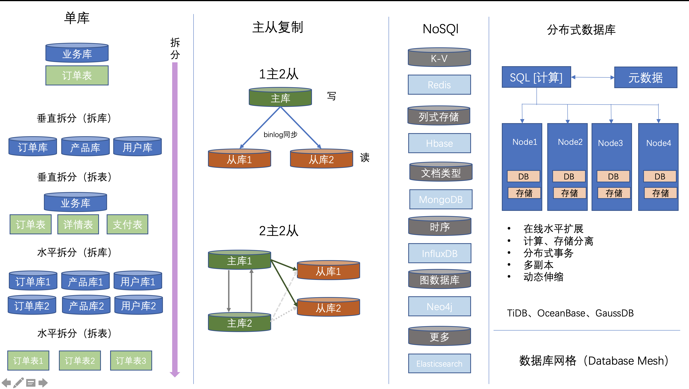

## 一. 数据库发展历程

1970 年，IBM 公司的研究员 E.F.Codd 在题为《大型共享数据库数据的关系模型》的论文中提出了数据库的关系模型，为关系数据库技术奠定了理论基础。然后就是商业关系数据库 Oracle 横空出世，随后 DB2，Sybase，SQLServer 等一批商业数据库兴起。

从 1990 年代起，伴随着自由软件和开源运动，开源数据库也诞生和发展起来。

以瑞典 MySQL AB 公司开发的 MySQL、开源社区开发的 PostgreSQL 为代表的开源关系数据库系统（RDBMS）逐渐引领了潮流。特别是 2000 年以后，随着互联网的飞速发展，开源免费的 MySQL 数据库以及其高效 MyISAM 引擎、2006 年发布的 InnoDB 引擎逐步赢得人们的青睐，成为最流行的数据库和引擎。

2006年google发了3篇论文，也是被认为的大数据3驾马车：分布式文件系统：GFS；分布式KV存储数据库：Big Table；处理和生成超大数据集的算法模型：MapReduce，这些论文的思想诞生了Hadoop生态，也为分布式数据库做好了基垫。

2012年Google又发表了2篇论文，分别是spanner和F1，我觉得如果想搞懂分布式数据库，建议这几篇论文都看看，看过论文的都知道，spanner讲的主要是如何基于全局事务时间戳实现事务的MVCC，并且可伸缩、同步多副本的全球化分布式数据库。F1作为一个DBMS之前作为mysql的前端提供数据服务，支持ACID，支持SQL，但是由于每次需要手动拆分MySQL的数据，后来F1将spanner作为自己的下游提供丝滑的扩容和数据自动重分布。

有了这些理论的支撑，产生了大量的分布式NoSql和分布式关系数据库。

## 二. 垂直、水平拆分

单库单表数据量超过一定容量水位的情况下，索引树层级增加，磁盘 IO 也很可能出现压力。
- 性能方面：索引深度的增加也将使得磁盘访问的 IO 次数增加，进而导致查询性能的下降；
- 可用性方面：服务化的无状态型，能够达到较小成本的随意扩容，这必然导致系统的最终压力都落在数据库之上；
- 运维成本：当一个数据库实例中的数据达到阈值（1TB 之内）以上，数据备份和恢复的时间成本会愈发不可控；

当单表数据过大时，我们就需要进行拆分。

### 1. 垂直拆分

- 拆库

基于业务，将原来在一个数据库中的表，拆分成2个独立的库。例如：将订单和产品变成两个独立的库。

- 拆表

对单表进行拆分。比如一个 200 列的订单主表，拆分成十几个子表：订单表、订单详情表、订单收件信息表、订单支付表、订单产品快照表等等。

**说明：**

上面所说的拆分方式，对业务系统有极大的影响，因为数据结构本身发生了变化，SQL 和关联关系也必随之发生了改变，这种改造的工作量可能跟新作一个系统差不多。所以，我们一般情况下，尽量少用这种办法。

### 2. 水平拆分

水平拆分就是直接对数据进行分片，有分库和分表两个具体方式，但是都只是降低单个节点数据量，但不改变数据本身的结构。这样对业务系统本身的代码逻辑来说，就不需要做特别大的改动，甚至可以基于一些中间件做到透明。

例如：比如把一个 10 亿条记录的订单单库单表（orderDB 库 t_order 表）。我们按照用户 id 除以 32 取模，把单库拆分成 32 个库；再按订单 id 除以 32 取模，每个库里再拆分成 32 个表。这样一共是 1024 个子表，单个表的数据量就只是 10 万条了。

**说明：**

水平拆分的方式解决了容量问题，以及部分性能、可用性以及单点备份恢复等问题，但会增加数据库运维的复杂度。

## 三. 主从复制

对于同一时刻有大量并发读操作和较少写操作类型的应用系统来说，将数据库拆分为主库和从库，主库负责处理事务性的增删改操作，从库负责处理查询操作，能够有效的避免由数据更新导致的行锁，使得整个系统的查询性能得到极大的改善。

如何配置MySQL主从复制、双机热备，请参考 <a href="/pages/e6406d/">MySQL 主从复制、热备</a>。

- 一主多从的配置方式，可以将查询请求均匀的分散到多个数据副本，能够进一步的提升系统的处理能力。

- 多主多从的方式，不但能够提升系统的吞吐量，还能够提升系统的可用性，可以达到在任何一个数据库宕机，甚至磁盘物理损坏的情况下仍然不影响系统的正常运行。

- 业务操作

  - 在业务系统的代码配置多个数据源，并根据自己的需要去把程序手动切换到对应的数据主库或某个从库
  - 通过代理层，根据执行的 SQL 是查询，还是插入、修改、删除，来判断，如果是前者就路由到从库执行，如果是后者就路由到主库执行。

**说明：**

读写分离虽然可以提升系统的吞吐量和可用性，但同时也带来了数据不一致的问题。这包括多个主库之间的数据一致性，以及主库与从库之间的数据一致性的问题。并且，读写分离也带来了与数据分片同样的问题，它同样会使得应用开发和运维人员对数据库的操作和运维变得更加复杂。

## 四. 分库分表

这里说的分库分表，针对的是对数据库进行水平拆分的情况。如何进行分库分表，先要梳理业务，确定是否要分，要怎么分，然后选择合适的技术框架进行操作。

分库分表的技术框架当前只需要使用 [ShardingSphere](!https://shardingsphere.apache.org/document/5.3.1/cn/overview/)。

**说明：**

1. 使用 `ShardingSphere` 进行分库分表，有一定的技术门槛，当业务系统有这方面需求的，联系我一起进行业务分析，由我来进行分库分表操作。
2. 考虑到公司的实际情况，尽量不要分库，单表数据量超过500万时，再考虑分表。

## 五. 分布式数据库

分布式数据库是用计算机网络将物理上分散的多个数据库单元连接起来组成的一个逻辑上统一的数据库。

参考：
- <a href="https://tidb.net/blog/eb3cb609" target="_blank">https://tidb.net/blog/eb3cb609</a>
- <a href="https://ost.51cto.com/posts/11105" target="_blank">https://ost.51cto.com/posts/11105</a>

## 六. 数据网格

<a href="https://www.modb.pro/db/47534" target="_blank">https://www.modb.pro/db/47534</a>

## 七. 建议

1. 使用云服务时，可以考虑云服务商提供的数据库服务，将数据库问题交给云，自己专注于业务开发。
2. 系统开发前，一定要先做好设计，不要后期进行大量改造。

