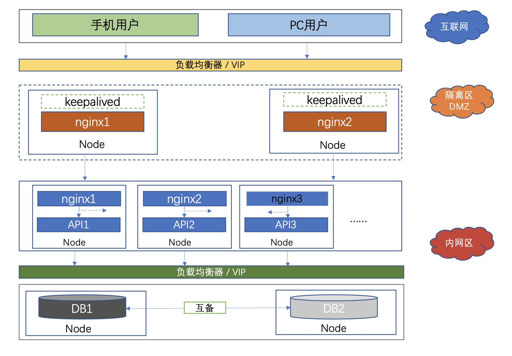
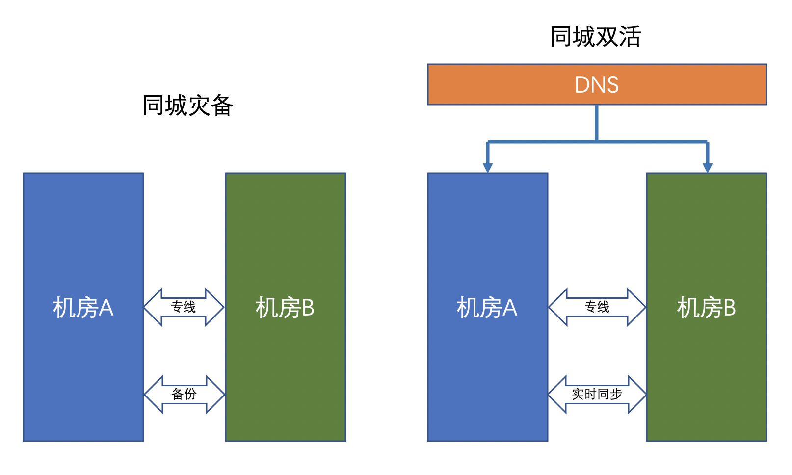
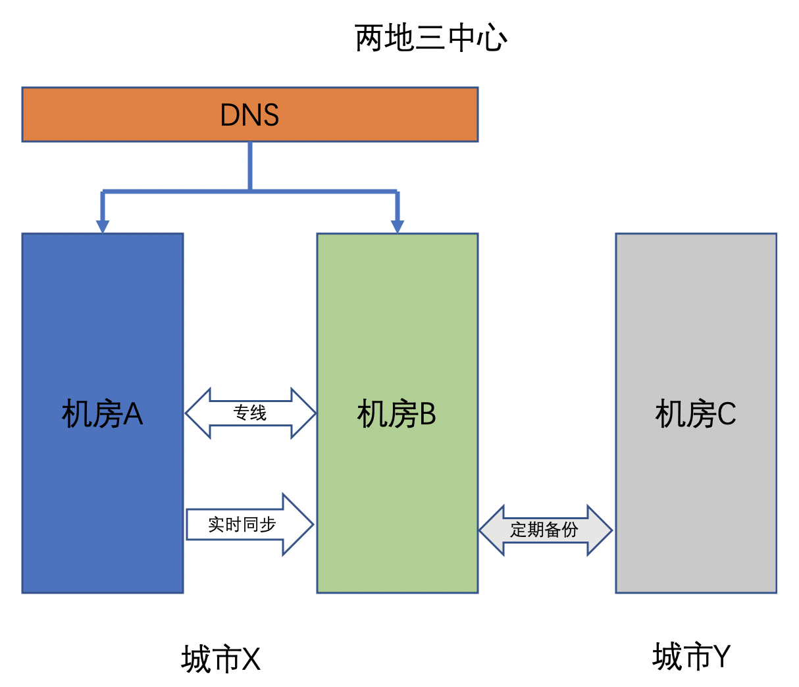
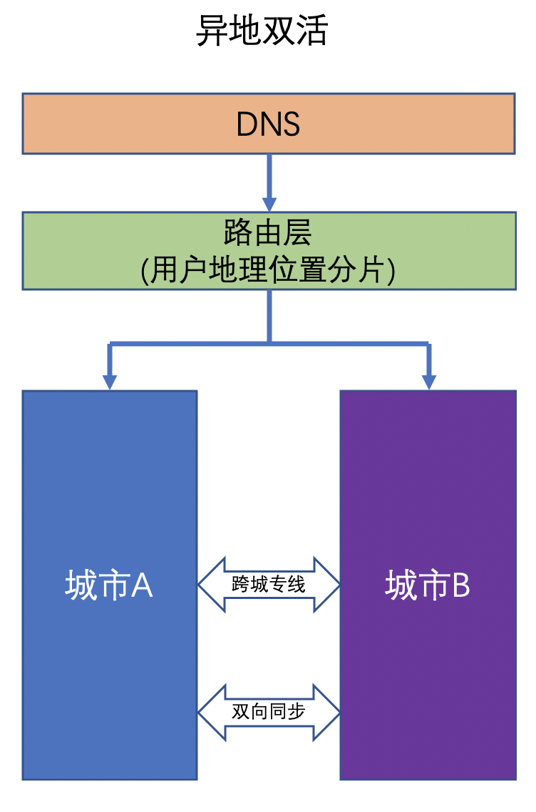

## 一.什么是高可用

### 1. 定义
高可用HA（High Availability），通常是指通过设计减少系统不能提供服务的时间。高可用性会结合两个概念来决定系统是否达到其运行性能水平：

- 特定设备或服务器几乎在任意时间都可访问或可用，没有停机时间。
- 该设备或服务器在特定时间段内的性能满足合理的预期。

高可用HA如何来来量化呢？

### 2. SLA
服务水平协议SLA（Service Level Agreement），通常包括服务提供商所承诺的服务水平、故障处理时间、可用性等指标。通过SLA，服务提供商向客户保证其提供的服务的质量和可靠性，同时也是服务提供商与客户之间保持良好关系的重要工具。

- 系统在连续运行1年时间里最多可能的业务中断时间

| 可用度    | 9的个数  | 年停机时间                                  |
| -------- | ------- | ----------------------------------------- |
| 0.9      | 1       | `(1-90%)*365 = 36.5天`                    |
| 0.99     | 2       | `(1-99%)*365 = 3.65天`                    |
| 0.999    | 3       | `(1-99.9%)*365*24 = 8.76小时`             |
| 0.9999   | 4       | `(1-99.99%)*365*24 = 0.876小时 = 52.6分钟` |
| 0.99999  | 5       | `(1-99.999%)*365*24*60 = 5.26分钟`        |
| 0.999999 | 6       | `(1-99.9999%)*365*24*60*60 = 31秒`        |

- 平均故障间隔（MTBF）：相邻两次故障之间的平均工作时间，也称为平均故障间隔。
- 恢复时间目标（RTO）：系统完成修复或重新运行所需的总时间。
- 恢复点目标（RPO）：能够恢复数据的时间点，它是可接受的丢失数据的时间窗口。举个例子，如果一个系统要靠从备份来恢复，而每天都会进行备份，那么恢复的系统中可能有 24 小时的数据丢失。但是，如果有复制或共享存储，那么数据丢失时间可能仅有几分钟或更短。

说明：
- 一般只有医疗卫生、政府及金融服务等任务关键型系统要求可用性达到5个9的标准。
- 许多企业/机构和行业也要求系统保持 99.9% 、99.99% 的运行时间。

参考：<a href="https://blog.csdn.net/chengyinwu/article/details/109536120" target="_blank">https://blog.csdn.net/chengyinwu/article/details/109536120</a>

### 3. 考虑的因素

硬件：包括网络、服务器、存储设备以及外部故障（如断电）。其中，网络可以借助多运营商接入来解决，存储有RAID、快照等应对技术，通过备份来提高数据安全性。

软件：应用高可用架构设计。

## 二. 应用策略

### 1. 集群化

高可用保证的原则是“集群化”，或者叫“冗余”：只有一个单点，挂了服务会受影响；如果有冗余备份，挂了还有其他backup能够顶上。

### 2. 自动故障转移

有了冗余之后，还不够，如果每次出现故障都需要人工介入恢复，势必会增加系统的不可服务风险。所以，又往往需要通过“自动故障转移”来实现系统的高可用。

## 三. 技术实现

### 1. 架构图

### 2. 开发

1. 应用无状态化

无状态的应用是指应用服务器不保存业务的上下文信息，而仅根据每次请求提交的数据进行相应的业务逻辑处理，多个服务实例（服务器）之间完全对等，请求提交到任意服务器，处理结果都是完全一样的。

需要着重考虑：
- 会话（Session）管理

  当前框架中，Session是通过Redis来管理的，所以应用程序不需要做单独处理。

- 本地缓存

  为了提高性能，我们往往会利用本地缓存来加快应用响应速度，减少数据库的访问压力。但在集群环境下，就要考虑服务的幂等性。这里可以考虑使用Redis来做缓存。

- 定时任务

  在集群环境下，我们一般希望某个定时任务只在某台服务器上运行，这时可以使用Redis分布式锁来实现定时任务只跑在某一台应用服务器上。

2. 服务降级设计

在应用访问高峰期，服务可能因为大量的并发调用而性能下降，严重时可能会导致服务宕机。为了保证核心应用和功能的正常运行，需要对服务进行降级。

降级有两种手段：拒绝服务及关闭服务。

- 拒绝服务：决绝低优先级应用的调用，减少服务调用并发数，确保核心应用正常使用；或者随机拒绝部分请求调用，节约资源，让另一部分请求得以成功，避免要死大家一起死的惨剧。
- 关闭服务：关闭部分不重要的服务，或者服务内部关闭不重要的功能，以节约系统开销，为重要的服务和功能让出资源。

3. 幂等性设计

应用调用服务失败后，会将调用请求重新发送到其他服务器，但是这个失败可能是虚假的失败。比如服务已经处理成功，但因为网络故障应用没有收到响应，这是应用重新提交请求就导致服务重复调用，如果这个服务是一个转账操作，就会产生严重后果。

服务重复调用时无法避免的，应用层也不关心服务是否真的失败，只要没有收到调用成功的响应，就可以认为调用失败，并重试服务调用。因此必须在服务层保证服务重复调用和调用一次产生的结果相同，即服务具有幂等性。

有些服务天然具有幂等性，比如将用户性别设置为男性，不管设置多少次，结果都一样。但是对于转账交易等操作，问题就会比较复杂，需要通过交易编号等信息进行服务调用有效性校验，只有有效的操作才能继续执行。

### 3. 运维

- 1. 监控告警

- 2. 自动化运维

- 3. 故障处理

## 四. 引申

###  1. 蓝绿部署

不停止老版本（绿版本），再部署一套新版本（蓝版本）。当新版本测试没有问题，通过负载（或者反向代理或者路由）将流量全部打到蓝版本，绿版本可以保存版本，然后再升级成蓝版本，接受新流量。适用于增量升级，对于涉及数据表结构变更等等不可逆转的升级，并不完全合适用蓝绿发布来实现，需要结合一些业务的逻辑以及数据迁移与回滚的策略才可以完全满足需求。

优点

- 对线上环境无任何影响，就算切换出现故障，也可以在很短的时间内进行处理。
- 线上始终只有一套版本，无需停机，风险小。

缺点

- 当切换到蓝色环境时，需要妥当处理未完成的业务和新的业务。如果数据库后端无法处理，会是一个比较麻烦的问题。
- 要考虑好DB和应用的同步迁移。
- 蓝绿部署需要在隔离的基础架构上进行操作。
- 资源冗余。

### 2. A/B 测试

A/B 测试，为了同一个目标制定两个方案（例如两个页面），让一部分用户使用 A 方案，另一部分用户使用 B 方案，通过用户的访问记录等数据确定更优的方案，接受更多的用户。A/B 测试主要是产品设计和运营的一种手段，核心思想是

- 多个方案并行测试
- 每个方案的不同点要明确、突出
- 要有明确的方案决策标准

对于技术上来说，需要做的工作有

- 开发两个（或多个）版本并部署
- 收集数据，推荐在前端进行分流，这样获取到用户的行为数据更细致、精确
- 数据分析（大数据、AI）

### 3. 灰度发布（金丝雀）

也叫做**金丝雀发布**。是指在黑与白之间，能够平滑过渡的一种发布方式。整个发布过程包含 A/B 测试。灰度发布可以保证整体系统的稳定，在初始灰度的时候就可以发现、调整问题，以保证其影响度。灰度期：灰度发布开始到结束期间的这一段时间，称为灰度期。技术上一般通过设置路由权重，动态调整不同的权重来实现。

- 启动一个新版本的应用，但不直接切换流量，让测试人员对新版本进行线上测试，这个新版本就是金丝雀。
- 如果测试没有问题，将少量的用户流量导入到新版本上，观察新版本的运行状态和数据指标，进行A/B测试。
- 如果新版本运行良好，逐步将更多的流量导入到新版本上，调整新旧版本的服务器副本数量，直到将所有流量都切换到新版本上，关闭老版本服务，完成灰度发布。
- 如果在灰度发布过程中发现新版本有问题，立即将流量切回老版本上，控制影响范围。

适用场景

- 不停止老版本，额外搞一套新版本，不同版本应用共存
- 灰度发布中，常常按照用户设置路由权重，例如: 90%的用户维持使用老版本，10%的用户尝鲜新版本
- 与A/B测试一起使用，要确定更优的产品方案
- 切换灰度发布（也叫刚性灰度发布），即在灰度发布的时候，没有过渡过程，流量直接从旧版本切换到新版本

### 4. 滚动发布

一般是取出一个或者多个服务实例停止服务，执行更新，并重新将其投入使用。周而复始，直到集群中所有的实例都更新成新版本。这种发布的方式可以节省资源，都是自动化进行的，节省人力。

缺点

- 没有一个确定OK的环境
- 回滚十分艰难，很可能需要人工介入，花费很多的时间解决问题
- 会出现短暂的新老版本不一致的情况（可使用 k8s readiness 和 liveness 解决）
- 和自动扩容/缩容同时进行时，不好掌控