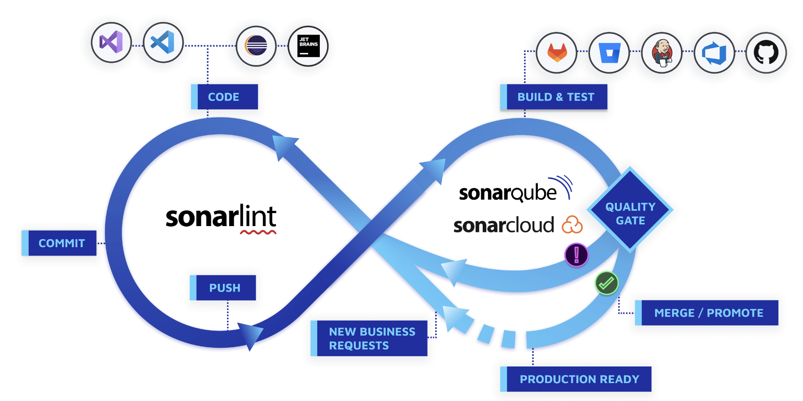
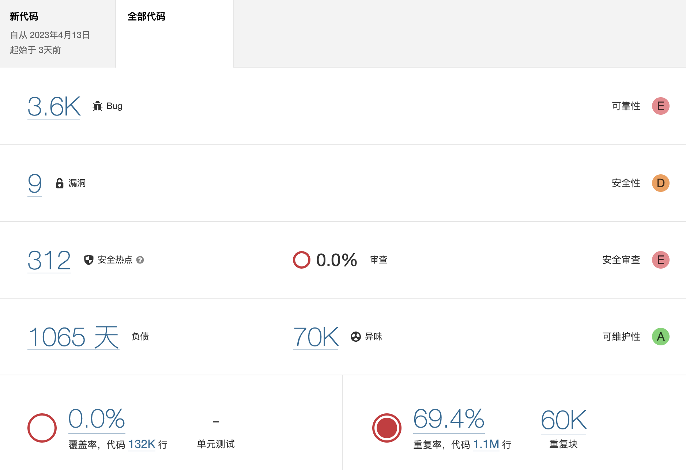
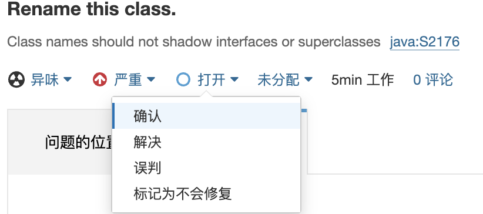

## 一. 概述

静态代码扫描是一种软件质量保证的方法，它可以在不运行程序的情况下，通过分析源代码的结构、语法、逻辑等方面，检测代码中可能存在的缺陷、漏洞、风险或不符合规范的地方。静态代码扫描可以提高代码的可读性、可维护性、可测试性和安全性，同时也可以减少后期的调试和修复成本。

静态代码扫描有很多种工具，我们这里使用 [SonarQube](https://docs.sonarqube.org/9.9)。

## 二. 使用

### 1. 访问地址

地址：<a href="http://doc.risun-tec.cn:9104" target="_blank">http://doc.risun-tec.cn:9104</a>，帐号信息：在微信群Java部群公告中获取。

### 2. 检测指标说明

- 严重程度

  - 阻断：很严重错误，必须修复的
  - 严重：可能会影响程序，需要审查
  - 主要：界面、性能缺陷、兼容性
  - 次要：易用性及建议性问题
  - 提示：需要关注，也可以忽略

- 可靠性：也就是bug，可靠性等级为ABCDE，bug一般指的是明显的错误

  - A 表示代码无bug
  - B 代码有一个次要bug
  - C 包含一个重要bug
  - D 有一个严重bug
  - E 有一个最高等级的阻断级别的bug

- 安全性：也就是安全漏洞，等级也分为ABCDE

  - A 为没有漏洞
  - B 为只要包含一个次要漏洞
  - C 为只要包含一个重要漏洞
  - D 只要包含一个严重漏洞
  - E 只要包含一个阻断漏洞

- 安全审查：安全敏感代码，需要手工审核，以便判断是否存在安全漏洞

- 技术债：是编程及软件工程中的一个比喻。指开发人员为了加速软件开发，在应该采用最佳方案时进行了妥协，改用了短期内能加速软件开发的方案，从而在未来给自己带来的额外开发负担。

- 代码覆盖率：单元测试覆盖率

- 代码重复率：Sonar并不能完全统计出真实的重复率，所以要根据实际情况判断。

## 三. 项目说明

### 1. 研发负责人

项目研发负责人需要对扫描结果进行管理，确保项目无漏洞、无Bug、无安全隐患。

### 2. 质量配置

并不是Sonar扫描出的问题都需要修改，有两种情况：

(1) 问题存在，但被扫描的项目研发负责人认为无需修改，可以编辑问题，排除问题。

(2) 某些代码规则不适用于我们项目，可以统一排除这些规则。

对于这种情况，项目研发负责人联系我，我会和部门技术负责人研判，来决定是否全局排除。