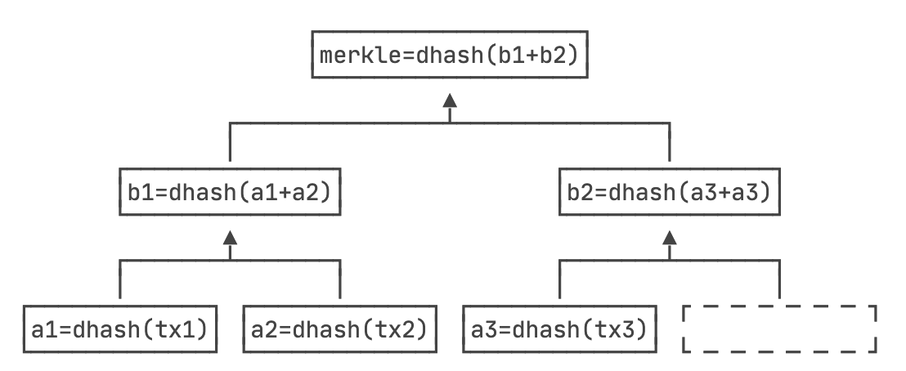

在阐明区块链工作原理前，我们需要知道并理解一些知识点。

## 一. 中心化

中心化是一种网络结构或系统模式，它依赖于一个中心节点或实体来控制或管理数据和信息，而其他的节点或参与者必须服从或依赖于这个中心。中心化的特点是权力集中、节点从属、网络脆弱和不透明。

现实中的常见的中心化机构和组织一般有：政府部门、金融机构、企业组织、非政府组织。

## 二. 非对称加密

有一对私钥和公钥，私钥持有人自己保管，公钥是公开的。私钥进行加密，公钥进行解密。公钥进行加密，私钥进行解密。

非对称加密的基本工作原理：

生成密钥对：首先，生成一对相关的密钥，其中一个是公钥，另一个是私钥。这两个密钥是数学上相关的，但不能通过已知的算法从公钥计算出私钥。

公钥加密：使用公钥加密要传输或存储的数据。任何人都可以获得公钥并使用它来加密消息。

私钥解密：只有私钥的持有者才能解密由公钥加密的数据。私钥保密，并且不应该与其他人共享。

例子：
``` md
Server - Client 通信

1. Server 发送信息

  （1） 对发送信息进行 Hash，生成摘要 digest。
  （2） 使用私钥对 digest 进行加密，生成数字签名 Signature。
  （3） 将回复信息和数字签名一同发送给 Client。

2. Client 验证消息
  
  （1）Client 使用公钥对签名进行解密，得到 Server 发送的摘要 digest 信息。
   (2) Client 对 Server 的回复信息进行 Hash，与 Server 发送的摘要 digest 信息进行比较。一致，则Server回复信息未被修改。
```

## 三. 哈希算法

单向散列算法，又称hash函数（杂凑函数，或者杂凑算法），就是把任意输入消息字符串变成固定长的输出串的一种函数，这个输出串称为该消息的杂凑值，一般使用产生消息摘要，密钥加密等。具体指的是根据输入消息计算后，输出固定长度数值的算法，输出数值也成为“散列值”或消息摘要，其长度通常在128~256位之间。比特币使用的哈希算法有两种：SHA-256 和 RipeMD160。

这类算法的特点是：正向计算容易，反向计算非常困难。例如：hash('123')=415258067487166476，其中hash('123')容易计算出415258067487166476，但通过415258067487166476很难计算出'123'

**哈希碰撞**

碰撞是指，如果两个输入数据不同，却恰好计算出了相同的哈希值。一个安全的哈希算法需要满足条件：碰撞率低。

SHA-256的理论碰撞概率是：尝试2的130次方的随机输入，有99.8%的概率碰撞。注意2130是一个非常大的数字，大约是1361万亿亿亿亿。以现有的计算机的计算能力，是不可能在短期内破解的。

**Merkle Hash（默克尔哈希）**

一种哈希树（Merkle Tree）结构中的哈希值。默克尔哈希是通过对数据块进行哈希计算，并通过递归地将哈希值进行合并，最终生成一个唯一的根哈希值。

Merkle Tree是一种二叉树结构，其中每个叶子节点都包含数据块的哈希值。而非叶子节点是通过将其子节点的哈希值拼接并再次进行哈希计算得到的。


