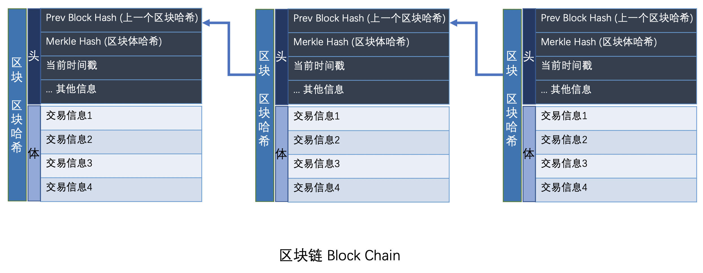

区块链就是一个不断增长的全网总帐本，每个完整节点都拥有完整的区块链，并且，节点总是信任最长的区块链，伪造区块链需要拥有超过51%的全网算力。

## 一. 区块链结构

区块链是由一个一个区块构成的有序链表，每一个区块都记录了一系列交易，并且，每个区块都指向前一个区块，从而形成一个链条。



## 二. 区块结构

每个区块都是由头部（Header）和体（Body）构成的，区块哈希(Block Hash) 是一个区块的唯一标识。

``` js
区块哈希(Block Hash) = Hash256(区块头)
```

### 1. 区块头

区块头中一般包含：`上一个区块哈希（Prev Block Hash）`，`区块体哈希（Merkle Hash）`，当前时间戳、其他信息（版本Version、目标难度Bits、Nonce等）

- **上一个区块哈希（Prev Block Hash）**

  链中，当前区块的上一个区块的区块哈希（Block Chain）。通过 Prev Block Hash 来追踪到上一个区块，进而构成整个区块链。

  区块链的第一个区块（又称创世区块）并没有上一个区块。因此，它的Prev Hash被设置为00000000...000。 

- **区块体哈希（Merkle Hash）**
  
  通过 `Merkle Hash` 算法，对区块体中的交易记录进行哈希计算，生成的哈希值。

### 2. 区块体

区块体中存放的是整个链上的所有交易记录，参与交易的主体都是匿名的。

交易主体持有私钥，发起交易时，会向整个区块链进行广播，广播的内容一般是公钥、地址以及交易信息的签名。其他交易主体通过公钥对交易消息进行验证。


## 三. 安全性

### 1. 交易消息

通过私钥可以对消息进行签名，签名可以保证消息防伪造，防篡改，防抵赖。

- 签名不可伪造，因为私钥只有签名人自己知道，所以其他人无法伪造签名；
- 消息不可篡改，如果原始消息被人篡改了，对签名进行验证将失败；
- 签名不可抵赖，如果对签名进行验证通过了，签名人不能抵赖自己曾经发过这一条消息。

### 2. 交易的可靠性

举例来说，小张要给小明1万块钱（数字货币），这笔交易要完成，有两个前提条件：

1. 这笔交易真是小张发出的
2. 小张真的有1万块钱（数字货币）

- 前提一，通过数字签名就可以验证这个声明是否是小张做的，并且，一旦验证通过，小张是无法抵赖的。

- 前提二，任何人都可以从区块链查询到任意公钥对应的比特币余额，因为任何人都有整个区块链的完整交易记录。这样就可以验证小张是否真的有交易1万块钱（数字货币）的能力。

**总结：**
- 私钥是花费比特币的唯一手段
- 所有交易被记录在区块链中，可以通过公钥查询所有交易信息

### 3. 篡改链上交易

最长链原则，拥有超过51%的全网算力才能篡改记录。

