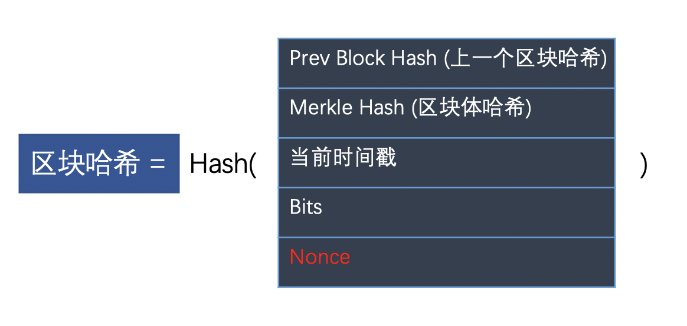
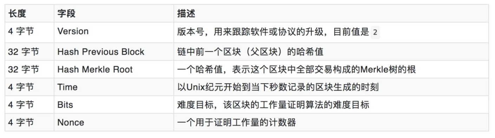
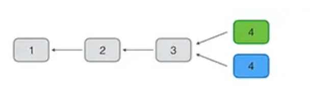
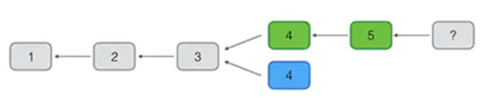

## 一. 什么是比特币

比特币是一种 P2P 形式的数字加密货币，基于区块链的一种应用形式。

## 二. 挖矿

由于必须保证节点之间的同步，所以新区块的添加速度不能太快。试想一下，你刚刚同步了一个区块，准备基于它生成下一个区块，但这时别的节点又有新区块生成，你不得不放弃做了一半的计算，再次去同步。
因为每个区块的后面，只能跟着一个区块，你永远只能在最新区块的后面，生成下一个区块。所以，你别无选择，一听到信号，就必须立刻同步。

**挖矿**：将新的交易打包成一个新的区块。

**矿工**：在比特币的P2P网络中，有一类节点，它们时刻不停地进行计算，试图把新的交易打包成新的区块并附加到区块链上，这类节点就是矿工。

**为什么要挖矿**：因为每打包一个新的区块，打包该区块的矿工可以获取`被打包交易中的手续费`以及一笔`比特币奖励`。

**比特币的数量**：区块链的发明者中本聪规定，平均每10分钟，全网才能生成一个新区块，一小时也就六个。挖矿成功的矿工会获得50（每过4年减半）个比特币，所以总数计算如下：


## 三. 挖矿原理

比特币的挖矿原理就是一种工作量证明机制。工作就是通过计算机计算数学问题。





**数学问题**：不断尝试计算区块的哈希，直到计算出一个特定的哈希值，它比目标值要小。

**目标值（target）**：目标值是一个大整数，表示挖矿过程中哈希值必须满足的条件，即哈希值的二进制表示中必须有多少个前导零，目标难度值是由Bits字段来计算的。

```properties
target = coefficient * 256^(exponent – 3) = 系数 * 256^(幂 - 3)

target = target * (actual time / expect time)  ## 预期时间：每挖2016个区块后，调整一次
```

**Bits**：表示目标难度值的编码形式，十六进制。用于表示前导零的个数和目标哈希值中的非零部分。具体来说，Bits字段的高位字节表示前导零的个数，低位字节表示目标哈希值中的非零部分。例如，如果前导零的个数为 20，目标哈希值的非零部分为 0x1A2B3C4D，那么对应的Bits字段的值将是 0x14000000。

- 幂：前2位十六进制数字
- 系数：后6位十六进制数字

**难度（difficulty）**：为了使区块哈希小于某个目标值（target），平均要尝试的计算次数。反映了矿工找到下一个有效区块的难易程度，难度随区块头目标值（target）的变动而变动，target值越小，难度越大。

```properties
difficulty = (创世区块目标值Target) / 当前目标值 = (0x00ffff * 256 ^ 26）/ target
```

**工作量计数器（Nonce）** 计算区块哈希时，头部信息除了`Nonce`都是固定不变的。挖矿就是不断的调整`Nonce`(随机数)来计算出满足要求的区块哈希。

## 四. 最长链原则（共识算法）

如果两个矿工在同一时间各自找到了有效区块，注意，这两个区块是不同的，因为coinbase交易不同，所以Merkle Hash不同，区块哈希也不同。但它们只要符合难度值，就都是有效的。



在分叉的情况下，有的矿工在绿色的分叉上继续挖矿，有的矿工在蓝色的分叉上继续挖矿。最终，总有一个分叉首先挖到后续区块，这个时候，由于比特币网络采用最长分叉的共识算法，绿色分叉胜出，蓝色分叉被废弃，整个网络上的所有矿工又会继续在最长的链上继续挖矿。



由于区块链虽然最终会保持数据一致，但是，一个交易可能被打包到一个后续被孤立的区块中。所以，要确认一个交易被永久记录到区块链中，需要对交易进行确认。如果后续的区块被追加到区块链上，实际上就会对原有的交易进行确认，因为链越长，修改的难度越大。一般来说，经过6个区块确认的交易几乎是不可能被修改的。

