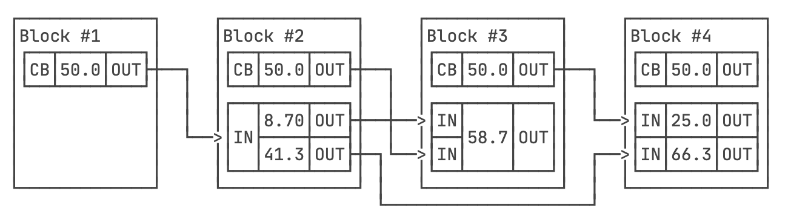
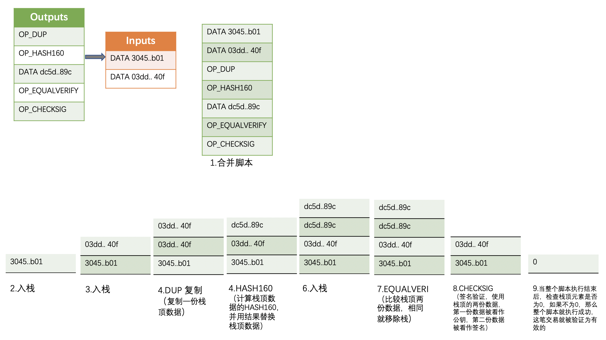

区块链中，每个区块都记录了至少一笔交易，一笔交易就是把一定金额的比特币从一个输入转移到一个输出。实际记录的是双方的公钥地址，并且比特币协议规定一个输出必须一次性花完。**区块中的第一个交易是挖矿的奖励。**

## 一. 输入和输出

在比特币交易中，输入（Inputs）和输出（Outputs）是交易的两个基本组成部分。它们用于确定交易的来源和目的地，以及交易的金额。

- UTXO

    未花费的输出被称为UTXO（Unspent Transaction Ouptut）。（可以简单理解为每次交易后的余额，不是总余额）

- 输入（Inputs）

    输入是指从之前的交易中选择的未使用的输出（Unspent Transaction Outputs，UTXO）。每个输入都引用了一个之前交易的输出，该输出包含了要使用的比特币金额和接收地址。

    输入包括两个主要信息：引用的交易哈希和输出索引。引用的交易哈希是之前交易的唯一标识符，输出索引表示在该交易中的输出索引位置。

    输入还包含一个用于验证交易的脚本（Script）。这个脚本通常是一个解锁脚本（Unlocking Script），用于提供交易所需的签名和其他验证信息，以证明当前交易是有效的。

- 输出（Outputs）

    输出是指将比特币发送给的目标地址。每个输出都包含一个接收地址和发送的比特币金额。

    输出包含两个主要信息：比特币金额和锁定脚本（Locking Script）。锁定脚本定义了接收地址的条件，只有满足这些条件的用户才能使用该输出。

    锁定脚本通常是一个加密哈希脚本（Hash Lock Script），它要求在未来的交易中提供一个解锁脚本（Unlocking Script），以证明拥有接收地址的私钥，从而花费该输出。

## 二. 交易脚本

比特币的支付实际上并不是直接支付到对方的地址，而是一个脚本，这个脚本的意思是：谁能够提供另外一个脚本，让这两个脚本能顺利执行通过，谁就能花掉这笔钱。这两个脚本被称作锁定脚本（Outputs）和解锁脚本（Inputs）。

比特币脚本是一种基于栈结构的编程语言。交易验证的过程就是把两个脚本组合成一个脚本，然后根据脚本，在栈中进行验证操作。

现实中的交易，[点击查看](https://explorer.btc.com/btc/transaction/a4bfa8ab6435ae5f25dae9d89e4eb67dfa94283ca751f393c1ddc5a837bbc31b)

## 三. 交易类型

### 1. P2PK（Pay 2 Public Key）

在P2PK交易输出中，交易脚本（script）包含了接收方的公钥。当要花费这个交易输出时，需要提供与公钥对应的私钥的数字签名来证明拥有权。数字签名将与公钥一起传递给验证脚本，验证脚本会验证签名和公钥的匹配性。

P2PK交易输出的优点是较为简单，直接向公钥进行支付，但缺点是交易输出中公钥会暴露在区块链中，存在一定的安全风险。

- 输入脚本：`OP_PUSHDATA <Sig>`

- 输出脚本：`OP_PUSHDATA <public_key> CHECKSIG`

### 2. P2PKH（Pay 2 Public Key Hash）

在P2PKH交易输出中，接收方的公钥经过哈希处理，得到公钥哈希值。交易输出脚本包含了这个公钥哈希值，而不是直接包含公钥。当要花费这个交易输出时，需要提供与公钥对应的私钥的数字签名，以及原始的公钥。验证脚本会对提供的签名和公钥进行验证，并检查公钥哈希值与提供的公钥是否匹配。

- 输入脚本：`OP_PUSHDATA <Sig> OP_PUSHDATA <public_key>`

- 输出脚本：`OP_DUP OP_HASH160 <public_key_hash> OP_EQUALVERIFY OP_CHECKSIG`

### 3. P2SK（Pay 2 Script Key）

P2SK交易，是将一段脚本（Script）进行哈希处理，得到一个脚本哈希值。交易输出脚本中包含了这个脚本哈希值，而不是直接包含脚本本身。当要花费这个交易输出时，需要提供与原始脚本对应的解锁脚本，以及执行原始脚本所需的其他参数。

主要用于多重签名（Multi-signature）交易，其中原始脚本定义了多个公钥的验证条件，解锁脚本中提供了相应的数字签名。这种方式可以实现多方共同管理一个比特币地址的安全性。

- 输入脚本：`OP_PUSHDATA <Sig> OP_PUSHDATA <serialized redeem-script>`

- 输出脚本：`OP_HASH160 <redeem-script_hash> OP_EQUAL`

- RedeemScript: `OP_PUSHDATA <public_key> OP_CHECKSIG`

P2SK 分为两个阶段的验证。阶段一：脚本验证；阶段二：RedeemScript验证。

## 四. 多重签名

由比特币的签名机制可知，如果丢失了私钥，没有任何办法可以花费对应地址的资金。这样就使得因为丢失私钥导致资金丢失的风险会很高。

为了避免一个私钥的丢失导致地址的资金丢失，比特币引入了多重签名机制，可以实现分散风险的功能。

具体来说，就是假设M个人分别持有M个私钥，只要其中N个人同意签名就可以动用某个“联合地址”的资金。

- 输入脚本：

`OP_PUSHDATA <Sig_1> OP_PUSHDATA <Sig_2> ... OP_PUSHDATA <Sig_n> OP_PUSHDATA <serialized redeem-script>`

- 输出脚本：`OP_HASH160 <redeem-script_hash> OP_EQUAL`

- RedeemScript: 

`M OP_PUSHDATA <public_key_1> OP_PUSHDATA <public_key_2> ... OP_PUSHDATA <public_key_m> OP_CHECKSIG`

