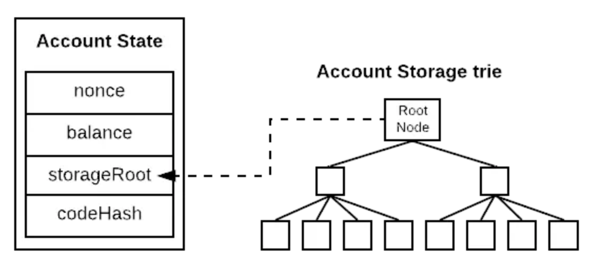

以太坊的账户是一个具有以太币 (ETH) 余额的实体，可以在以太坊上接收、持有和发送 ETH 和 token，并与已部署的智能合约进行交互。 帐户可以由用户控制，也可以作为智能合约部署。

**账户有两种类型：**
- 外部所有的帐户 (EOA) – 由任何拥有私钥的人控制
- 合约帐户 — 部署到网络上的智能合约，由代码控制

两种类型账户的区别：
- 外部账户

  - 创建帐户是免费的
  - 可以发起交易
  - 外部所有的帐户之间只能进行以太币和代币交易
  - 由一对加密密钥组成：控制帐户活动的公钥和私钥

- 合约账户

  - 创建合约存在成本，因为需要使用网络存储空间
  - 只能在收到交易时发送交易
  - 从外部帐户向合约帐户发起的交易能触发可执行多种操作的代码，例如转移代币甚至创建新合约
  - 合约帐户没有私钥，只有地址（公钥），由智能合约代码逻辑控制

**账户状态：**
账户状态反映了一个以太坊账户的各项信息。例如，它存储了当前账户以太币的余额信息、当前账户发送过的交易数量...每一个账户都有账户状态。

| Account State                                                |
| ------------------------------------------------------------ |
| Nonce                             （从此地址发送出去的交易数量（记录数） ） |
| balance                           （账号所拥有的以太币数量余额） |
| storageRoot                    （账户存储树的根节点哈希值，MPT 树） |
| codeHash                        （合约账户存储在 EVM 中代码的哈希值，不可变得） |

