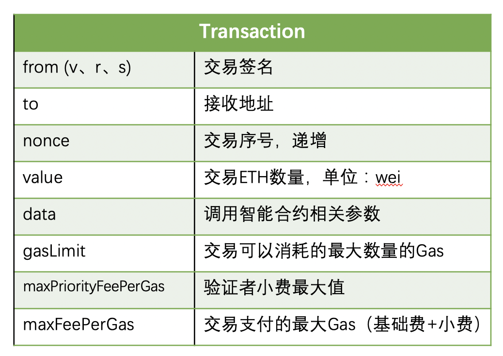
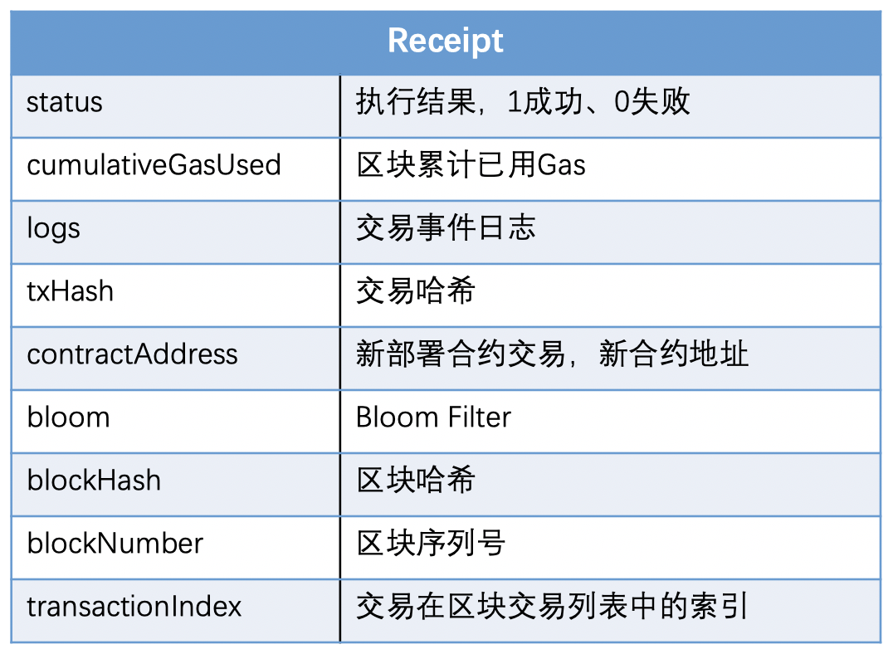

## 一.说明
交易是由外部所有帐户发起的签名消息，由以太坊网络传输，并在以太坊区块链上进行记录（挖掘）。在这个基本定义背后，有很多令人惊讶和着迷的细节。看待交易的另一种方式是，它们是唯一可触发状态更改或导致合约在EVM中执行的东西。以太坊是一个全球的单实例状态机器，交易是唯一可以让状态机“运动”，改变状态的东西。合约不会自行运行。以太坊不会在后台运行。一切都始于交易。

## 二.原理

以太坊中，每个交易包含如下信息，每个区块体中包含一系列交易信息，区块头部存储这些交易的MPT根部哈希编码。

以太坊中，每一笔交易作为消息在以太坊虚拟机中执行时，均会获得一个交易回执信息(Receipt)。

