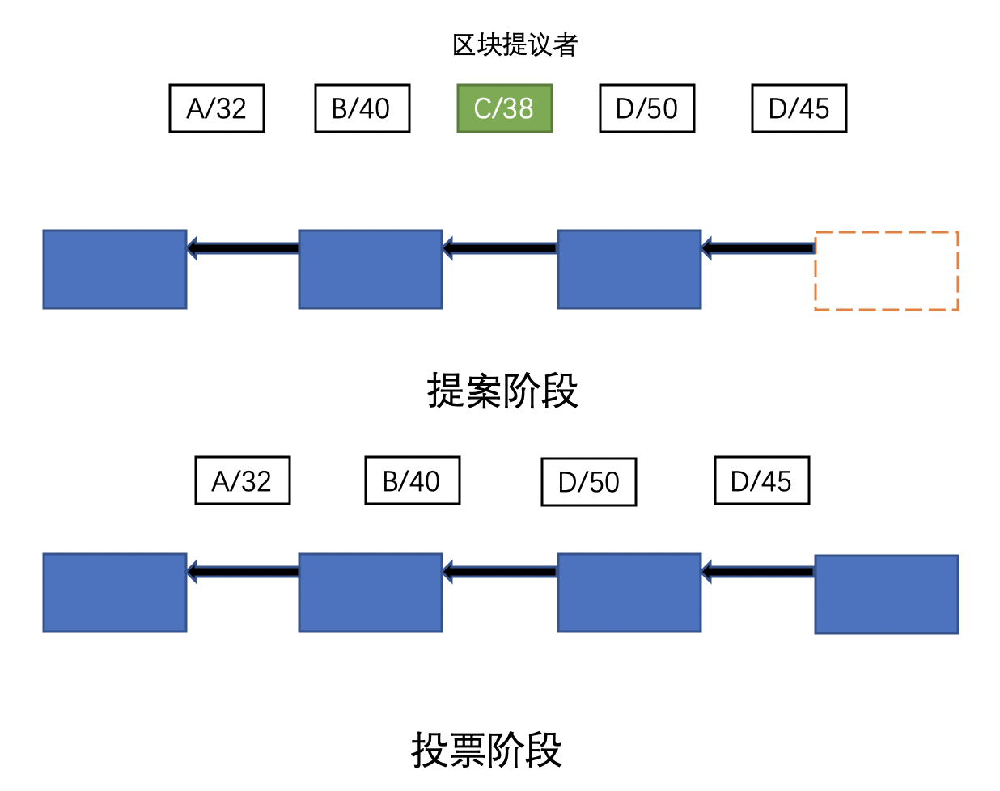

## 一.说明

权益证明（POS，Proof of Stake），即股权投票机制。用户先在以太网中抵押一笔保证金（>=32ETH），根据共识协议，每一个区块验证周期（Epoch），从这些用户中选出一部分做成本次区块的验证者（Validator）。

这些验证者（Validator）中，根据算法选出一个区块提议者，构建并广播下一个要添加到以太坊区块链上的区块，其他的验证者进行投票（抵押ETH）验证，当投票超过总抵押ETH的2/3时，该区块升级为合理区块，添加到区块链上。

整个过程，验证用户需要运行三种软件（执行客户端、共识客户端、验证客户端）才能参与以太坊的权益证明。

## 二.验证步骤

**整个权益证明机制分为两个阶段：提案阶段和验证阶段**

- 候选验证者

  用户先在以太网中抵押一笔保证金（>=32ETH），成为候选验证者。

- 验证交易有效性

  验证者节点，执行客户端打包有效的交易，将交易列表存储在本地内存中，然后广播到其他的验证节点。当其他节点听到关于交易的消息时，它们也将其添加到本地内存池中。

- 提议信标区块

  到达当前时隙时，从验证者中伪随机选出一个验证者（区块提议者），负责构建下一个要添加到以太坊区块链的区块，并广播给其他验证者。这个区块被称为信标区块。

- 最终确定
  
  验证者通过共识客户端接收新的信标区块，并将其传递给它们的执行客户端。在执行客户端上，交易在本地重新执行以确保提议的状态更改有效。当投票超过总抵押ETH的2/3时，该区块升级为合理区块，添加到区块链上。

## 三.区块分叉

虽然权益证明机制可以降低分叉的风险，但以下情况可能导致分叉的发生：

- 双重提案（Double Proposal）：在提案阶段，可能存在恶意验证者同时提出了两个或多个不同的区块，试图将网络分成两个分支。这种情况下，部分验证者可能选择其中一个分支进行验证，而其他验证者则选择另一个分支，导致分叉发生。

- 网络延迟或分区（Network Delay or Partition）：如果网络存在延迟或分区的情况，导致不同的节点在同一时间内无法达成一致，也可能会引发分叉。不同的节点可能会接收到不同的提案，并选择不同的分支进行验证，从而导致分叉的发生。

为了解决分叉问题，权益证明机制通常会采用一些机制和规则，以确保网络最终达到一致。其中一种常见的机制是最长链原则，即网络中选择最长的分支作为有效链。这意味着在分叉发生后，随着时间的推移，网络上选择最长链的分支将获得更多的确认和认可，而其他分支将逐渐被抛弃。

此外，权益证明机制还可能采用其他的共识算法和防止分叉的机制，如惩罚机制、随机选择验证者、委员会等。这些机制旨在确保网络的安全性和一致性，并尽可能减少分叉的发生。

总结而言，虽然权益证明机制可以降低分叉的风险，但在特定的情况下仍然可能发生分叉。恶意行为、网络延迟或分区等因素可能导致不同的节点选择不同的分支，从而引发分叉。然而，权益证明机制通过采用一些机制和规则来解决分叉问题，并确保网络最终达到一致性。