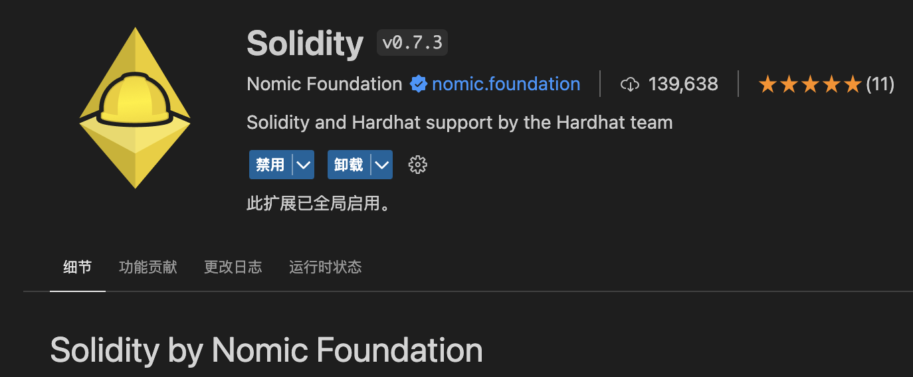
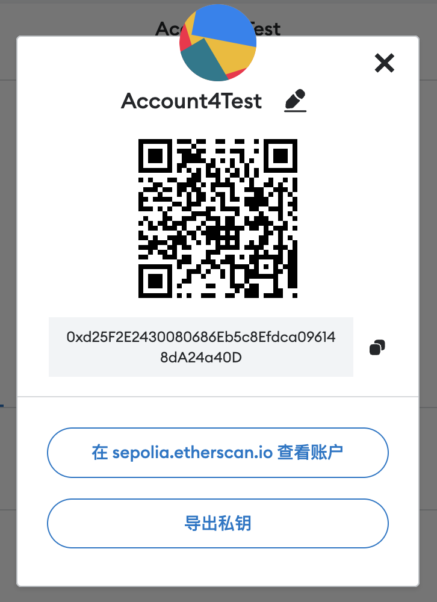
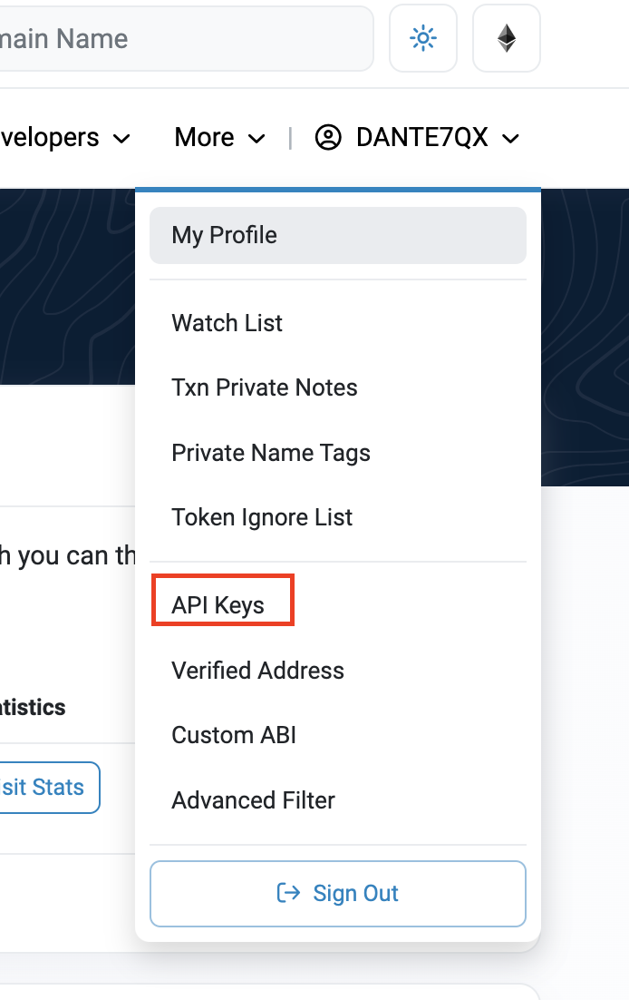
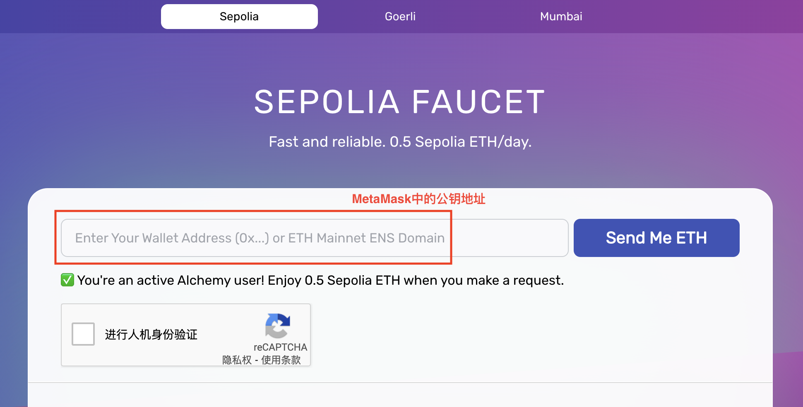
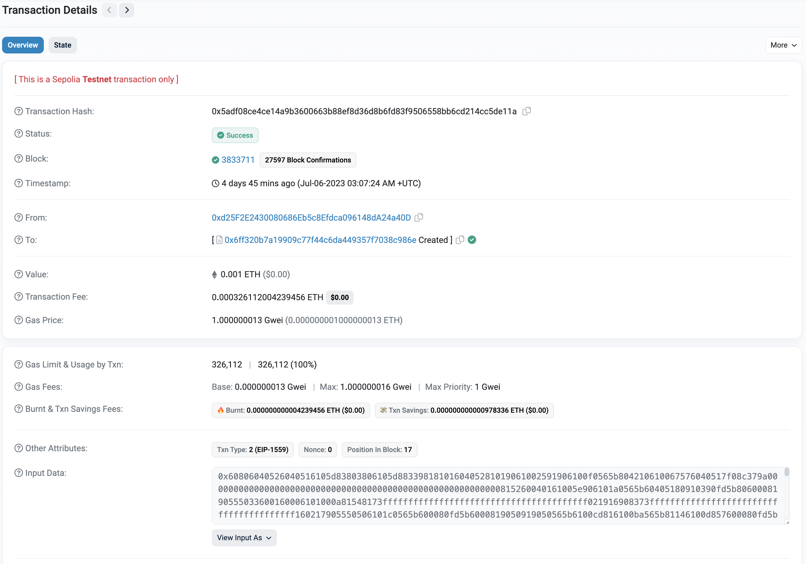

## 一. 概述

Hardhat是一个用于Ethereum软件的开发环境。它由不同的组件组成，用于编辑、编译、调试和部署你的智能合约和DApps，所有这些组件一起工作以创建一个完整的开发环境。

Hardhat Runner是你在使用Hardhat时交互的主要组件。它是一个灵活和可扩展的任务运行器，可以帮助你管理和自动化开发智能合约和dApps所固有的经常性任务。

Hardhat Runner是围绕任务和插件的概念设计的。每次你从命令行运行Hardhat时，你都在运行一个任务。例如，npx hardhat compile 运行内置的编译任务。任务可以调用其他任务，允许定义复杂的工作流程。用户和插件可以覆盖现有的任务，使这些工作流程可定制和可扩展。

## 二. 安装及示例

开发工具可以选择`Visual Studio Code`，安装`Solidity`扩展，Windows 系统推荐使用 [WSL 2](https://learn.microsoft.com/en-us/windows/wsl/install)。



本例使用`npm`，版本 >= 7

``` bash
## 创建一个空目录，并初始化
mkdir hello && cd hello
npm init

## 添加 hardhat 依赖包
npm install --save-dev hardhat

## 创建 hardhat 项目（包含：智能合约示例、示例合约的单元测试、示例合约部署脚本）。选择 Create a JavaScript project
npx hardhat
## 可选操作
# 简写工具，命令行 hh = npx hardhat ，执行 npm install --global hardhat-shorthand 安装
# 命令自动完成，执行 hardhat-completion install 安装

## 验证安装，运行如下命令，查看 hardhat 的版本
npx hardhat --version
 
## 编译智能合约，示例智能合约 contracts/Lock.sol
npx hardhat compile

## 测试智能合约，测试文件位于 test/ 目录下
npx hardhat test

## 部署智能合约（本地）
## 开启一个本地 hardhat 网络节点
npx hardhat node

## 将智能合约部署到本地 hardhat 网络节点
npx hardhat run scripts/deploy.js --network localhost

```

## 二. 部署到以太坊测试网

智能合约在本地验证通过后，需要将智能合约部署到[以太坊（主网）](https://etherscan.io)中，而在这之前，应该将智能合约先部署到测试网中，进行充分的测试后，再部署到主网中。

测试网选择 `Sepolia`，[Sepolia 测试网络](https://sepolia.etherscan.io)。

<font color="red">注意：要完成操作，需要科学上网（浏览器和命令行）。</font>

要部署到[Sepolia 测试网络](https://sepolia.etherscan.io)，需要进行如下操作：

### 1. 创建一个电子钱包帐户

安装[MetaMask](https://metamask.io)，注册并创建一个帐号。主要信息：地址、私钥。



### 2. 创建一个 Etherscan 帐户

打开[Etherscan explorer](https://etherscan.io)，注册并创建一个帐号。主要信息：API Keys。



### 3. 创建一个 Alchemy 账户

[Alchemy](https://www.alchemy.com)是一个以太坊开发者平台，提供了一系列工具和服务，帮助开发者构建和扩展基于以太坊的应用程序。它旨在简化以太坊开发过程，提供更好的开发体验和性能优化。

与以太坊通信，需要注册并创建一个帐号。主要信息：API Keys。

### 4. 获取测试以太币

将智能合约部署到Sepolia测试网中，需要消耗测试以太币。可以在[Alchemy Sepolia Faucet](https://sepoliafaucet.com)中免费获取。



- 修改配置`hardhat.config.js`

```js
const ALCHEMY_API_KEY = "Alchemy API Key";
const METAMASK_PRIVATE_KEY = "MetaMask钱包中的账户私钥";

module.exports = {
  solidity: "0.8.18",
  etherscan: {
    apiKey: "<ETHER_SCAN_API_KEY>",
  },
  networks: {
    sepolia: {
      url: `https://eth-sepolia.g.alchemy.com/v2/${ALCHEMY_API_KEY}`,
      accounts: [METAMASK_PRIVATE_KEY],
    },
  },
  ...
};
```

### 5. 部署智能合约
```bash
## 部署到Sepolia 测试网络
npx hardhat run scripts/deploy.js --network sepolia


## 验证智能合约Lock.sol, <address> 是智能合约地址, <unlock time> 是时间（毫秒）
## 注意：验证前，先在 Etherscan 中手工发布智能合约源码并验证
npx hardhat verify --network sepolia <address> <unlock time>

## 跟多详情，请查看 https://hardhat.org/hardhat-runner/plugins/nomicfoundation-hardhat-verify
```

### 6. 查看结果
执行成功后，结果可以在 Etherscan 中进行查看




