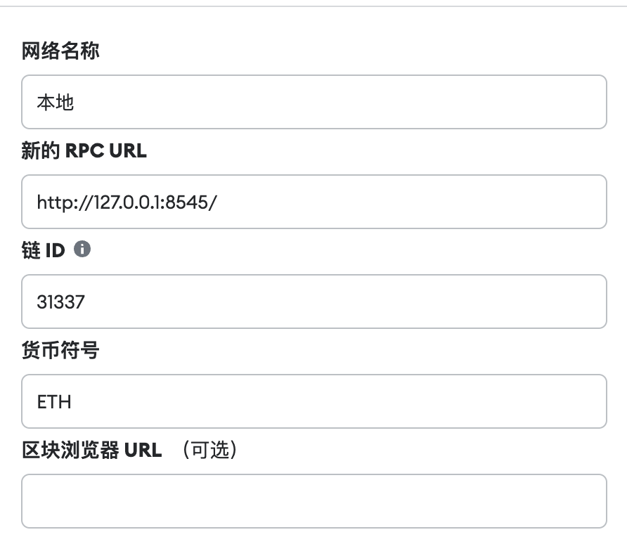
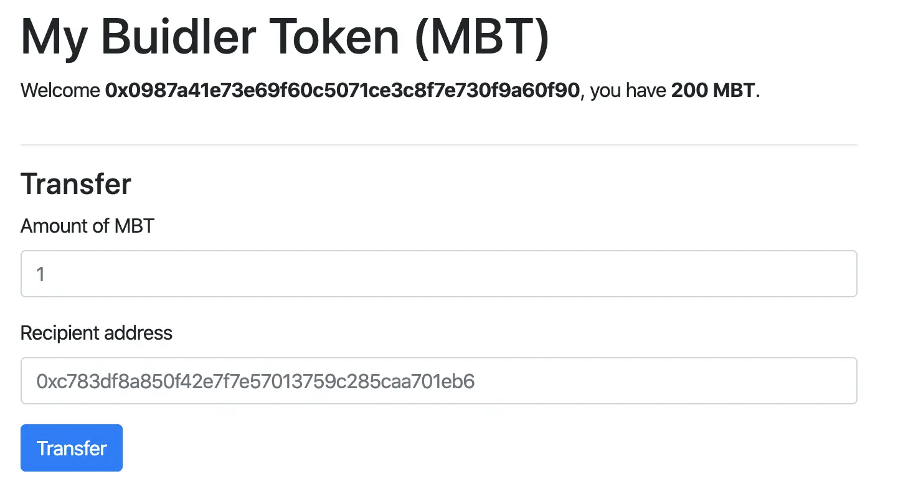

## 一.概述

去中心化应用（Decentralized Application，简称dApp）是指构建在区块链或其他分布式网络上的应用程序。与传统的中心化应用不同，dApp 不依赖于单一的中心化服务器或实体来运行，而是通过智能合约和分布式网络的共识机制来实现去中心化的特性。

> 工作原理：

去中心化应用的后端代码（智能合约）运行在一个去中心化的 P2P 网络上，而非中心化的服务器。他们使用以太坊区块链网络作为数据存储端，并且用智能合约实现app的业务逻辑。

一个智能合约像是一套设立在区块链上的规则，所有人都可以准确地观察和运行这套规则。设想一下，有一台自动贩卖机：如果向它提供足够的资金和正确的选择，您将得到您想要的货品。正如自动贩卖机一样，智能合约可以像您的以太坊账户一样存储持有资金。这允许代码之间协议和交易。

一旦去中心化应用部署到以太坊网络，您将无法更改他们。去中心化应用之所以可以被去中心化就是因为他们被合约中的逻辑所控制，而不是机构或者个人。

> 特性

- 去中心化：dApp 不依赖于单一的中心化机构或服务器，而是通过分布式网络中的节点共同维护和执行应用逻辑。

- 开放性：dApp 的代码和协议通常是开放的，任何人都可以查看、审查和参与其中。这种开放性可以增加透明度和安全性，并激励社区参与和贡献。

- 共识机制：dApp 通过分布式网络的共识机制来达成一致并保障数据的可靠性和安全性。常见的共识机制包括工作量证明（Proof of Work）和权益证明（Proof of Stake）等。

- 加密货币激励：一些 dApp 使用加密货币作为应用内部的激励机制，鼓励用户参与和贡献。这些加密货币通常由应用的智能合约发行和管理。

- 不可篡改性：一旦数据被写入区块链，通常是不可篡改的。这增加了数据的安全性和可信度，使 dApp 更具可靠性。

## 二.DAPP的好处和缺陷

> 好处

- 零停机时间： 一旦将某 dapp 的智能合约部署到区块链上，整个网络都能为那些希望与合约互动的客户提供服务。 因此，恶意参与者无法针对单个 dapp 发起 DoS 攻击。

- 隐私： 您不需要提供真实世界的身份来部署或与 dapp 进行交互。

- 抵制审查： 网络上没有任何一个实体可以阻止用户提交交易、部署 dapp 或读取区块链上的数据。

- 数据完整性： 由于采用了加密基元，存储在区块链上的数据是不可更改和无可争议的。 恶意行为者无法伪造已经公开的交易或其他数据。

- 无需信任的计算/可验证的行为： 智能合约可以分析并保证以可预测的方式执行，而无需信任中心化组织。 这在传统模式下是不存在的，比如我们使用网上银行系统时，我们要相信金融机构不会滥用我们的金融数据，不会篡改记录，也不会被黑客攻击。

> 缺陷

- 维护： dapp 可能更难维护，因为发布到区块链的代码和数据更难修改。 在部署后，即使发现了漏洞或安全风险，开发人员很难对去中心化应用程序（或其存储的底层数据）进行更新。

- 性能开销： 巨大的性能开销，而且难以扩展更多性能。 为了达到以太坊所追求的安全、完整、透明和可靠的水平，每个节点都会运行和存储每一笔交易。 除此之外，达成权益证明共识也需要时间。

- 网络拥塞： 在当前模型中，如果一个 dapp 使用了太多的计算资源，整个网络都会承担影响。 目前，该网络每秒只能处理约 10-15 笔交易；如果交易发送的速度超过这个速度，未确认的交易池会迅速膨胀。

- 用户体验：设计用户友好的体验可能更难。普通终端用户可能会发现，很难以真正安全的方式设置与区块链互动所需的工具堆栈。

  - 技术门槛：区块链和加密货币技术对于非技术用户来说可能是相对陌生和复杂的。处理私钥、钱包、交易手续费等概念和操作可能需要用户具备一定的技术理解和操作技能。

  - 用户界面复杂性：一些现有的区块链钱包和交互界面可能不够直观或用户友好，缺乏简单易用的设计和指导。用户可能需要在不同的应用程序之间来回切换，进行多个操作步骤，导致体验繁琐。

  - 安全风险：与区块链互动需要妥善保护私钥和身份验证信息，以确保资金和数据的安全。然而，安全性的要求和操作复杂性可能会使用户感到不安或困惑，尤其是在面对潜在的钓鱼、诈骗和恶意软件攻击的情况下。

- 集中化：无论如何，建立在以太坊基础层之上的用户友好型和开发人员友好型解决方案最终看起来都像集中式服务。 例如，这种服务可以在服务器端存储密钥或其他敏感信息，使用中心化服务器为前端服务，或在写到区块链之前在中心化服务器上运行重要的业务逻辑。 这消除了区块链与传统模式相比的许多（并不是全部）优势。

  - 服务器存储敏感信息：为了提供更好的用户体验，某些解决方案可能在服务器端存储用户的私钥或其他敏感信息。这样做可以提供方便的访问和恢复机制，但同时也将用户的安全性依赖于中心化的服务器。

  - 中心化服务器服务：一些解决方案可能使用中心化服务器作为前端服务的中介，以提供更快速和高效的响应。这可能导致用户的交互与中心化服务器的连接紧密耦合，而不是直接与区块链进行交互。

  - 中心化业务逻辑：为了实现更复杂的功能或提供更好的用户体验，某些解决方案可能在写入区块链之前在中心化服务器上运行重要的业务逻辑。这样做可能带来更高的灵活性和效率，但也削弱了去中心化应用的核心特点。

## 三.应用场景
很多去中心化应用还在实验中，测试去中心化网络的可能性。但在科技、金融、游戏和收藏品类中，已经有一些成功的先行者。

- 去中心化金融
这些是专注在构建使用加密货币进行金融服务的应用，它们提供像借、贷、赚取利息，以及不需要个人信息的私密支付等服务。

- 艺术品和收藏品
这些应用专注于数字所有权，增加创作者的收入潜力，并发明新的方式来投资您喜爱的创作者及其作品。

- 游戏
这些侧重于创造虚拟世界和同其他玩家竞技的应用使用具有现实世界价值的收藏品。

## 四.研发DAPP

DAPP的后端（智能合约）部分，以前在之前的文档中介绍过了，这里着重介绍前端部分。

前端部分使用 `ether.js` + `Vue（或 React）`，主要是调用`ethers.js`的相关用法。[Ethers.js官网](https://docs.ethers.org/v6)

### 1.Hardhat 示例

Hardhat 提供了一个前端模板，提供图形界面和智能合约做交互。

模板中包含智能合约和前端应用。

- 1. 下载模板代码

```bash
git clone https://github.com/NomicFoundation/hardhat-boilerplate.git
cd hardhat-boilerplate
npm install
```

- 2. 运行本地测试网络

```bash
npx hardhat node

## 打开新的终端，执行命令，部署合约
npx hardhat run scripts/deploy.js --network localhost
```

- 3. 启动前端

```bash
cd frontend
npm install
npm start
```
启动成功后，在浏览器访问: http://localhost:3000


- 4.配置电子钱包

以 MetaMask 为例，在设置中添加网络，并切换网络


- 5.发送MBT和ETH，并测试转账

```bash
## 使用部署帐户的余额向你的地址发送100 MBT和1 ETH。
npx hardhat --network localhost faucet <MetaMask地址>
```

**转账页面**
