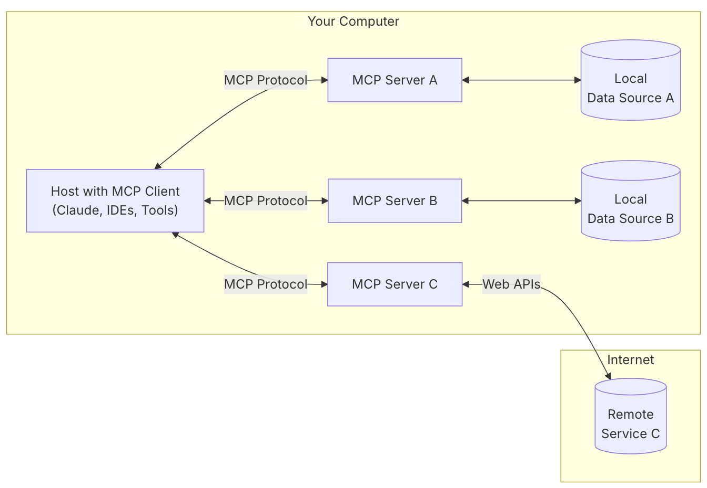
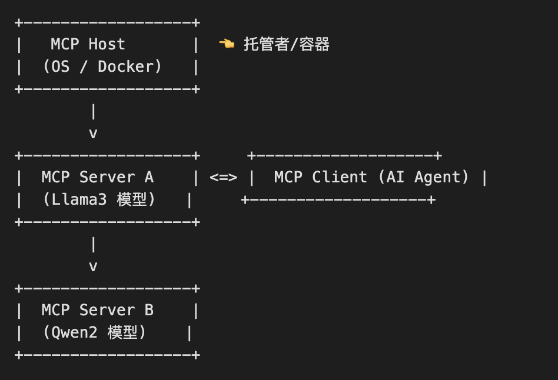
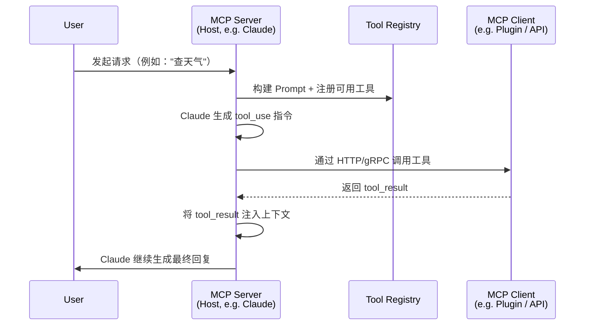

# MCP协议

## 一. 概述

MCP (Model Context Protocol) 是由 Anthropic 提出的一种用于与 LLM（如 Claude、Qwen）交互的结构化格式协议。它的目标是: 
- 统一模型上下文的格式
  - prompt 的结构
  - 系统提示（system instructions）
  - 用户输入/助手回复
  - 引用文献（citations）
  - 工具调用（tool use）
- 提供明确的 role（角色）、工具使用、引用、指令等语义
- 支持更复杂和可控的模型交互方式

## 二. 架构

- **MCP HOST**：

    MCP Host 是可以运行一个或多个 MCP Server 的“宿主环境”或“容器”，是更高层次的概念。
    
    例如：假设你开发了一个带 AI 助手、知识库问答和插件系统的 app，MCP Host 就是协调 Claude 与工具/插件交互的“大脑”。

  - 负责 管理 MCP Client 的生命周期，协调与 MCP Server 的通信
  - 作为 用户界面，接收用户输入并展示 AI 生成的响应
  - 可能集成多个 MCP Clients，以支持不同的工具和资源

- **MCP Client**: 

    MCP Client 是嵌入在 Host 中的组件，负责与 MCP Server 建立连接并进行通信。

    例如：一位开发者编写了一个简单的 Web 应用程序，该应用程序作为 MCP Client 连接到远程的 MCP Host 上托管的语言模型，以实现智能问答功能。

  - 发起请求：向 MCP Host 发送请求以执行某些操作（如文本生成、图像识别等）
  - 处理响应：接收并处理 MCP Host 返回的结果，展示给用户或者进一步处理
  - 事件监听：监听来自 MCP Host 的实时反馈或事件（例如流式输出、错误报告等）
  - 会话控制：管理与 MCP Host 之间的会话，包括创建、更新和结束会话

- **MCP Server**:

  MCP Server 是实现了 MCP 协议的服务端程序，能接收 Client 请求并提供模型推理、工具调用等服务。每个 MCP Server 通常绑定一个 AI 模型或插件集。

- **Local Data Sources**: MCP Server 可安全访问您的计算机文件、数据库和服务

- **Remote Services**: MCP Server可通过互联网（如 API）连接的外部系统。如：天气API、新闻API等

## 五. 参考资料

- https://docs.anthropic.com/zh-CN/home

