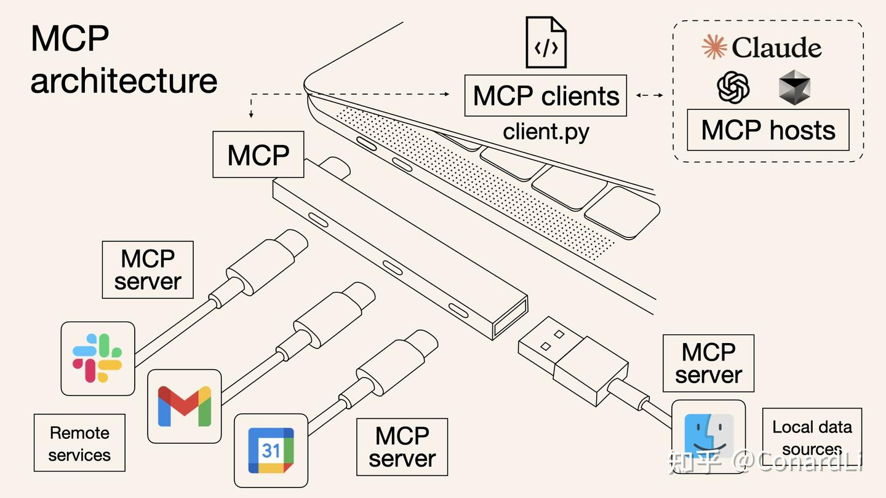
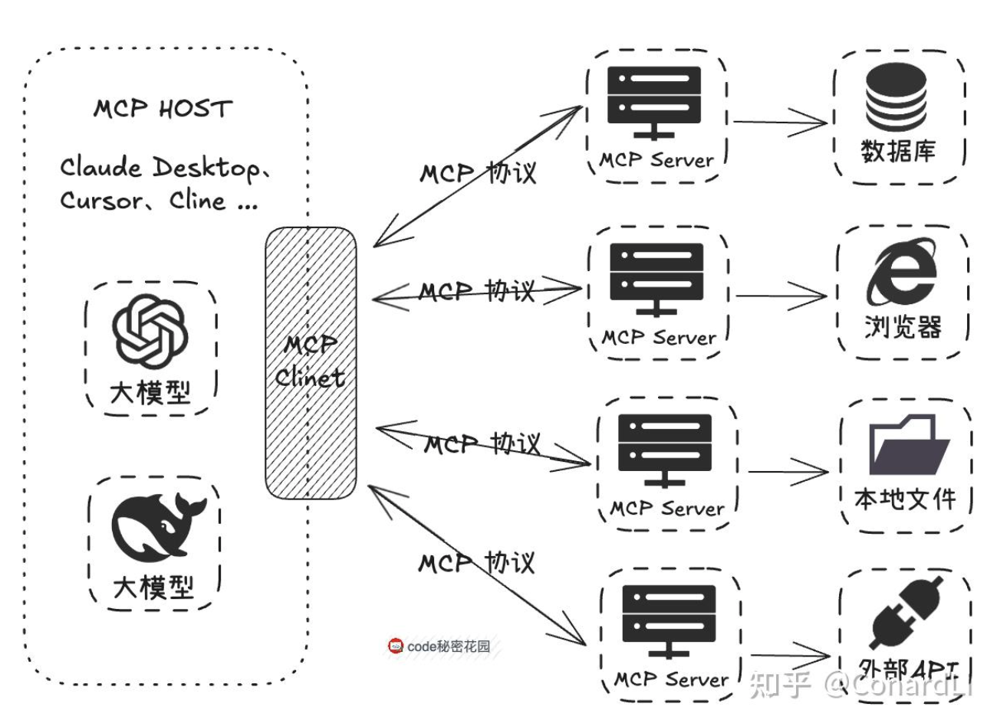

<a href="/html/mcp_learning.html" target="_blank">MCP 学习计划</a>

## 一. 概念及架构原理

### 1.核心概念
MCP（Model Context Protocol，模型上下文协议）是一种由 Anthropic 公司推出的一个开放标准协议，目的就是为了解决 AI 模型与外部数据源、工具交互的难题。

它就像是一个 “通用插头” 或者 “USB 接口”，制定了统一的规范，不管是连接数据库、第三方 API，还是本地文件等各种外部资源，都可以通过这个 “通用接口” 来完成，让 AI 模型与外部工具或数据源之间的交互更加标准化、可复用。

### 2.架构原理
MCP 的架构原理非常简单，它将 AI 模型与外部数据源、工具或文件进行交互，通过一个通用的接口，实现数据交换。
具体来说，MCP 的工作流程如下：
1. AI 模型通过 MCP 接口发送请求，请求需要的数据或功能。
2. MCP 接收到请求后，会根据请求的类型，调用相应的外部数据源、工具或文件，获取所需的数据。
3. 外部数据源、工具或文件返回数据后，MCP 会将数据返回给 AI 模型。
4. AI 模型接收到数据后，就可以使用这些数据进行后续的计算或处理。

**MCP Server**:  

负责接收 MCP 请求，并调用外部数据源、工具或文件，返回数据。每一个`Server`专注于一个特定的数据源或工具集，比如文件系统、数据库、API服务等。
`Server`实现了 一个`Server`接口，定义了如何接收 MCP 请求，如何调用外部数据源、工具或文件，如何返回数据。
1. 实现协议层：处理MCP通信协议、消息格式、连接管理等
2. 暴露Resources：提供可访问的数据资源（如文件、数据库记录）
3. 暴露Tools：提供可调用的功能接口
4. 暴露Prompts：提供可重用的提示模板
5. 权限和安全控制：管理访问权限、验证请求等

**MCP Client**:  

负责向 MCP Server发送请求，并接收返回的数据。Claude这样的`AI Agent`就是典型的MCP Client，它可以通过MCP协议与多个`MCP Server`通信。

**MCP Host**:  

负责管理 MCP Server和 Client，提供统一的接口，让 AI 模型可以方便地使用外部数据源、工具或文件。

**AI Agent**: 

充当`MCP Client`的角色。通过MCP协议与外部服务器通信。`LLM`负责理解用户意图和生成响应，而MCP让`AI Agent`能够获取实时数据和执行外部操作，两者结合才构成了完整的智能助手体验。

核心特征: 
- 多模态输入处理能力
  - 文本、图片、音频等多种输入格式
  - 复杂的预处理和格式转换逻辑
- 会话管理能力
  - 多轮对话支持
  - 本地存储会话历史
  - 上下文连续性维护
- 完整的`MCP Client`实现
  - 协议转换和通信管理
  - 与LLM的标准化交互

### 3.主要组件
MCP协议包含三个核心抽象：
1. `Resources`: 表示外部数据源，如文件、数据库记录、API响应等。
2. `Tools`: Server 暴露可执行功能（MCP Server对外提供的功能接口），供 LLM 调用以与外部系统交互。，如`read_file`、`write_file`等。
3. `Prompts`: Server 定义可复用的提示模板，引导 LLM 交互。
4. `Sampling`：让 Server 借助 Client 向 LLM 发起完成请求，实现复杂的智能行为。

### 4.主流实现

- <a href="https://github.com/modelcontextprotocol/servers" target="_blank">官方MCP Server实现</a>
- <a href="https://mcp.so" target="_blank">MCP Server 聚合平台</a>
- <a href="https://mcpmarket.cn" target="_blank">MCP Market</a>
- <a href="https://smithery.ai" target="_blank">Smithery 聚合</a>

## 五. 参考资料

- https://zhuanlan.zhihu.com/p/1892565780807255460