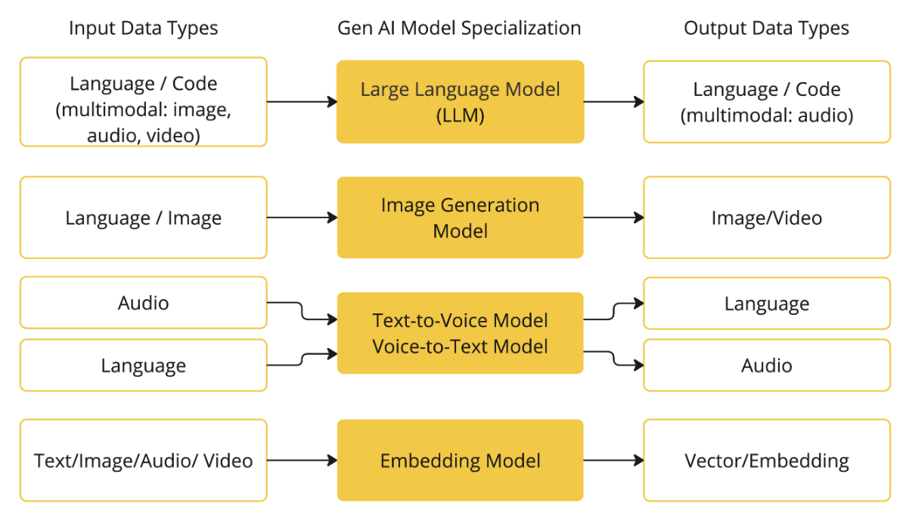
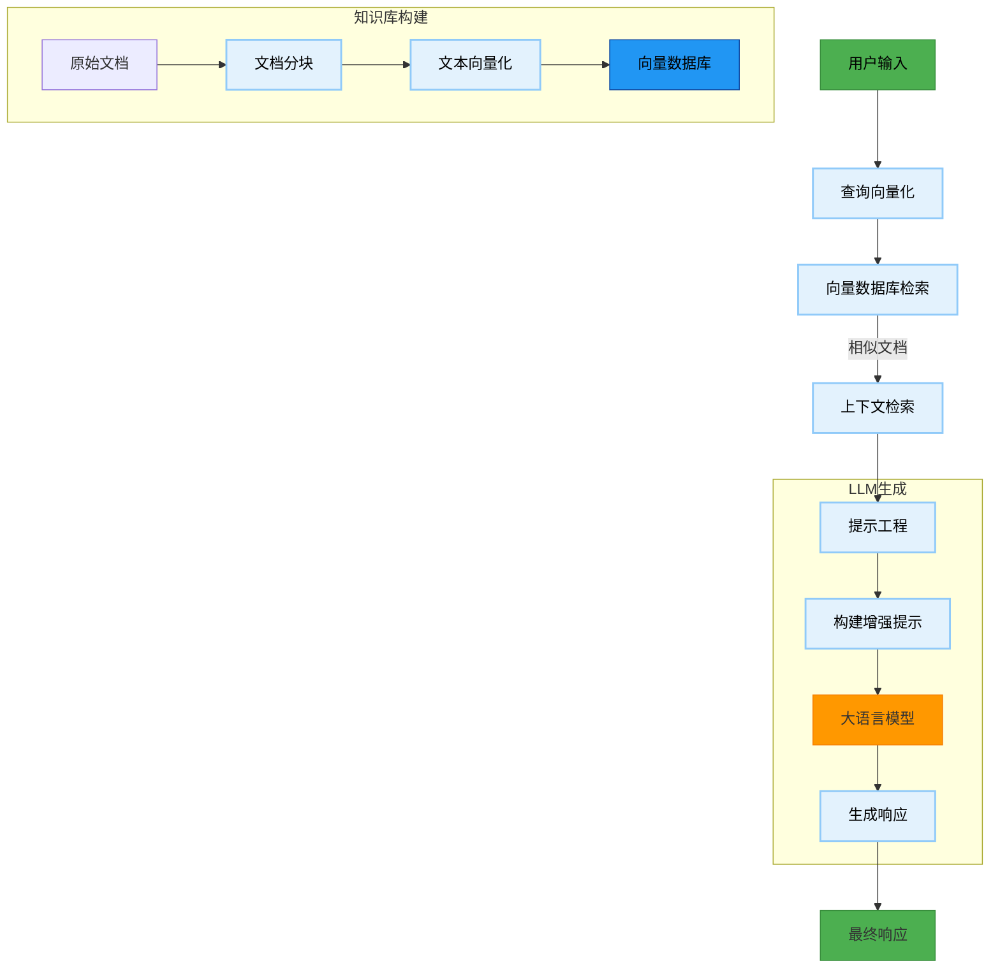

了解 AI 的核心概念是学习和应用 AI 的基础。以下是一些关键概念：

## 模型 Models
AI 模型是 AI 的核心。通过从大量数据集中学习模式和见解，这些模型可以进行预测、文本生成、图像处理等，从而增强各行各业的应用程序。

常见的模型类型包括：

- **神经网络（Neural Networks）**：模仿人脑结构的计算模型。
- **决策树（Decision Trees）**：一种基于树结构的模型，用于分类和回归任务。
- **支持向量机（Support Vector Machines）**：一种用于分类和回归任务的模型。
- **随机森林（Random Forests）**：一种集成学习模型，由多个决策树组成。
- **卷积神经网络（Convolutional Neural Networks）**：一种用于图像识别和计算机视觉的模型。
- **循环神经网络（Recurrent Neural Networks）**：一种用于序列数据的模型，如文本和语音识别。
- **生成式模型（Generative Models）**：一种模型，用于生成新数据。
- **概率图模型（Probabilistic Graphical Models）**：一种用于处理概率数据的模型，如贝叶斯网络和图ical模型。
- **深度学习（Deep Learning）**：一种基于神经网络的模型，具有高度的表示能力。
- **深度 reinforcement learning（Deep Reinforcement Learning）**：一种基于深度学习的强化学习模型。
- **无监督学习（Unsupervised Learning）**：一种模型，用于从数据中寻找模式和结构。
- **半监督学习（Semi-Supervised Learning）**：一种模型，用于处理半标记的数据。
- **集成学习（Ensemble Learning）**：一种模型，通过集成多个模型来提高性能。

`Spring AI` 目前支持处理语言、图像和音频输入输出的模型。

## 提示 Prompts
提示（prompt）是 AI 模型如何进行预测和生成的输入。提示通常包含一个或多个输入，以及一个或多个输出。例如，一个提示可能包含一个图像和一个文本描述，AI 模型会根据图像和描述生成一个新图像。
提示的生成通常需要根据模型的类型和需求进行定制。以下是一些常见的提示生成方法：

- **文本生成**：提示通常包含一个或多个输入，例如一个文本片段。模型会根据输入生成一个新文本片段。
- **图像生成**：提示通常包含一个或多个输入，例如一个图像。模型会根据输入生成一个新图像。
- **语音生成**：提示通常包含一个或多个输入，例如一个音频片段。模型会根据输入生成一个新音频片段。
- **文本分类**：提示通常包含一个输入和一个输出，例如一个文本片段和一个标签。模型会根据输入生成一个标签。
- **图像分类**：提示通常包含一个输入和一个输出，例如一个图像和一个标签。模型会根据输入生成一个标签。
- **语音分类**：提示通常包含一个输入和一个输出，例如一个音频片段和一个标签。模型会根据输入生成一个标签。
- **文本摘要**：提示通常包含一个输入和一个输出，例如一个文本片段和一个摘要。模型会根据输入生成一个摘要。
- **图像识别**：提示通常包含一个输入和一个输出，例如一个图像和一个标签。模型会根据输入生成一个标签。
- **语音识别**：提示通常包含一个输入和一个输出，例如一个音频片段和一个标签。模型会根据输入生成一个标签。
- **文本翻译**：提示通常包含一个输入和一个输出，例如一个文本片段和一个翻译。模型会根据输入生成一个翻译。
- **图像翻译**：提示通常包含一个输入和一个输出，例如一个图像和一个翻译。模型会根据输入生成一个翻译。
- **语音翻译**：提示通常包含一个输入和一个输出，例如一个音频片段和一个翻译。模型会根据输入生成一个翻译。

### Prompt Templates
提示模板（prompt template）是提示的生成模板。提示模板通常包含一个或多个占位符，这些占位符会根据输入进行替换。例如，一个提示模板可能包含一个占位符，该占位符会替换为输入的文本片段。

在 `Spring AI` 中，提示模板（Prompt Templates） 可以类比为 `Spring MVC` 架构中的“视图（View）”。通常会提供一个 java.util.Map 类型的模型对象，用于填充模板中的占位符。这个模板经过“渲染”后生成的字符串，就成为了发送给 `AI Model`的提示内容。

发送给 AI 模型的提示信息在具体数据格式上存在较大差异。最初，提示只是简单的字符串。但随着发展，提示逐渐演进为包含多条消息的形式，其中每条消息中的字符串都代表了模型需要区分的不同角色（如系统、用户、助手等）。

## 嵌入 Embeddings

嵌入是文本、图像或视频的数值化表示，它们能够捕捉输入内容之间的关系。

嵌入的工作原理是将文本、图像和视频转换为浮点数数组，称为向量 (vectors)。这些向量旨在捕捉文本、图像和视频的含义 (meaning)。嵌入数组的长度称为向量的维度 (dimensionality)。

通过计算两段文本向量表示之间的数值距离（距离），应用程序可以判断生成这些嵌入向量的原始对象之间的相似度 (similarity)。

嵌入在诸如检索增强生成 (Retrieval Augmented Generation, RAG) 模式这样的实际应用中尤为重要。它们使数据能够被表示为语义空间 (semantic space) 中的点。这个语义空间类似于欧几里得几何中的二维平面空间，但维度更高。这意味着，就像欧几里得几何中平面上点的位置（坐标）决定了它们是相近还是远离一样，在语义空间中，点的邻近性 (proximity) 反映了含义的相似性。关于相似主题的句子在这个多维空间中的位置会更靠近，就像图表上彼此靠近的点一样。这种邻近性有助于完成诸如文本分类、语义搜索甚至产品推荐等任务，因为它使 AI 能够根据相关概念在这个扩展的语义“景观”中的“位置”来识别和归类它们。

对 Java 开发者，无需深入理解这些向量表示背后复杂的数学理论或具体实现细节。了解它们在 AI 系统中所扮演的角色 (role) 和功能 (function) 即可，尤其是在将 AI 功能集成到您的应用程序中时。

## Tokens（“词元” 或 “标记”）
Tokens 是 AI Model 运作的基本构成单位。在输入时，模型会将词语转换为`Token`；在输出时，又会将`Token`转换回词语。在英语中，一个`Token`大约相当于 一个词的 75%。

Tokens = Money，输入和输出都计费
- 输入（Input tokens）：你发送给模型的内容（提示词、上下文等）
- 输出（Output tokens）：模型返回给你的内容（生成的回答、文本等）

所以：
- 合理设计提示词（Prompt Engineering）可以减少不必要的 token 使用
- 对于长文本，可以考虑压缩或摘要后再输入

## RAG (Retrieval-Augmented Generation)
RAG 是一种结合了信息检索和生成的技术，主要用于增强 `LLM` 的能力。

它通过以下步骤工作：
1. **检索阶段**：从大规模数据集中检索与输入查询相关的信息。
2. **生成阶段**：使用检索到的信息和输入查询生成最终的输出。
3. **反馈阶段**：将生成的输出与用户提供的反馈进行比较，以改进模型的性能。
4. **迭代**：重复上述步骤，直到模型达到预期的性能。
5. **应用**：将模型部署到实际应用中，以提供更准确和有用的服务。
6. **监控**：定期监控模型的性能，以确保其持续改进。
7. **优化**：根据监控结果，对模型进行优化和改进。

1. 用户输入阶段
   - 用户输入：用户提出问题或请求
   - 查询向量化：将用户查询转换为向量表示

2. 知识库构建（离线处理）
   - 原始文档：知识源（PDF、网页、数据库等）
   - 文档分块：将大文档分割为小片段
   - 文本向量化：将文本块转换为向量
   - 向量数据库：存储向量化知识（如FAISS、Pinecone等）

3. 检索阶段
   - 向量数据库检索：在向量空间中查找相似文档
   - 上下文检索：获取与查询最相关的文档片段

4. 生成阶段
   - 提示工程：构建包含上下文和查询的提示模板
   - 构建增强提示：组合查询+检索到的上下文
   - 大语言模型：使用LLM（如GPT、Llama等）生成响应
   - 生成响应：基于上下文和查询生成最终答案

5. 输出阶段
   - 最终响应：返回给用户的增强答案

## 工具调用 Tool Calling (Function Calling)

工具调用是一种允许 `AI Model` 调用外部工具（如 API、数据库、文件系统等）的机制。`Tool Calling` 可以帮助 `AI Model` 更准确地执行任务，提高效率。

- LLM 的知识是静态的：模型只能基于训练时的数据进行回答，无法获取最新信息。
- 工具调用让 LLM “活”起来：通过调用外部 API，LLM 可以
    - 查询实时数据（如天气、股票价格）
    - 执行数据库操作
    - 调用业务系统接口完成具体任务

## Evaluating AI responses ( AI 响应评估)
评估AI回应是一个结合了语言学、计算机科学、心理学和伦理学的交叉领域。它远不止是检查对错那么简单，而是一个在准确性、帮助性、安全性等多个维度之间不断权衡和取舍的复杂过程。

### 评估的核心维度 (What to Evaluate)

**1. 准确性与事实性 (Accuracy & Factuality)**
- 核心问题：AI说的是真的吗？信息来源可靠吗？
- 挑战：这是最基本也是最难的一点。AI可能会出现“幻觉”（Hallucination），即一本正经地编造事实。评估时需要借助搜索引擎、知识库或专家知识来核实。

**2. 相关性与帮助性 (Relevance & Helpfulness)**
- 核心问题：AI的回答是否切中要点？是否真正解决了用户的潜在需求？
- 举例：用户问“苹果股价”，AI回答了苹果公司的历史，这就是不相关的。用户问“如何缓解焦虑”，一个充满同理心、提供具体可行建议的回答，就比只给一个医学定义要有帮助得多。

**3.清晰度与连贯性 (Clarity & Coherence)**
- 核心问题：回答的语言是否流畅自然？逻辑结构是否清晰？是否容易理解？
- 评估点：是否有语法错误、用词不当、逻辑混乱、前后矛盾等问题。

**4. 安全性与无害性 (Safety & Harmlessness)**
- 核心问题：回答是否包含偏见、歧视、暴力、仇恨言论或任何有害内容？是否会诱导用户进行危险行为？
- 这是AI伦理的底线，也是所有AI公司的重中之重。评估需要专门的“红队测试”（Red Teaming），故意用各种刁钻、危险的问题去“攻击”模型，以发现安全漏洞。

**5. 全面性与深度 (Comprehensiveness & Depth)**
- 核心问题：回答是否提供了足够的信息？深度是否符合用户的预期？
- 举例：对于一个复杂问题，比如“解释一下量子纠缠”，一个只给出一句简单比喻的回答可能深度不够；而一个既有比喻，又有基本原理解释，还能指出其应用领域的回答，就更全面。

**6. 简洁性 (Conciseness)**
- 核心问题：回答是否言简意赅？有没有啰嗦、重复的废话？
- 在保证信息完整的前提下，越简洁的回答通常越好。

**7. 风格与语气 (Style & Tone)**
- 核心问题：AI是否遵循了用户的指令来调整自己的风格？（例如：请用苏格拉底的风格回答……）
- 语气是否恰当？（例如：在安慰用户时应富有同情心，在解释技术问题时应客观中立。）

### 评估方法 (How to Evaluate)

**1. 人工评估 (Human Evaluation)**

人工评估是目前最可靠、最主流的评估方式，被视为“黄金标准”。因为它能理解语言的细微差别、文化背景和复杂的人类价值观。

**2. 自动评估 (Automatic Evaluation)**

人工评估成本高、速度慢，因此需要自动化评估方法来辅助和扩展。

## 温度 Temperature

Temperature 是一个用来控制模型生成文本时 “创造性” 或 “随机性” 程度的关键参数。

- **温度越低，AI的回答越确定、越保守**。它会倾向于选择概率最高的词语，输出的内容会非常稳定、可预测，更注重事实和逻辑。
- **温度越高，AI的回答越随机、越有创意**。它会增加选择低概率词语的可能性，使得输出的内容更多样化、更令人惊喜，但同时也增加了出现不相关、不连贯甚至胡说八道的风险。

Temperature 是你在与AI交互时，控制其“性格”的一个非常强大的旋钮。想让它当严谨的“科学家”，就调低温度；想让它当奔放的“艺术家”，就调高温度。

**应用场景**：

| 场景               | 推荐 Temperature | 原因说明                                                                 |
|--------------------|------------------|--------------------------------------------------------------------------|
| 事实问答、知识提取   | 低 (0.1 - 0.4)   | 需要最准确、最符合事实的答案，不希望 AI 自由发挥。                              |
| 代码生成、代码补全   | 低 (0.2 - 0.4)   | 代码需要精确无误，随机性可能导致语法错误或逻辑问题。                             |
| 文本摘要、翻译       | 中低 (0.5 - 0.7) | 需要在忠于原文的基础上，进行一些自然的语言组织。                                 |
| 通用聊天、客服机器人 | 中等 (0.7 - 0.9) | 需要在提供有用信息和保持对话趣味性之间取得平衡。                                 |
| 创意写作、头脑风暴   | 高 (0.9 - 1.2+)  | 希望 AI 打破常规，提供意想不到的点子、故事线或诗句。                             |
| 角色扮演、游戏对话   | 高 (0.9 - 1.1)   | 需要 AI 生成符合角色性格、充满变化和个性的对话。                                 |

