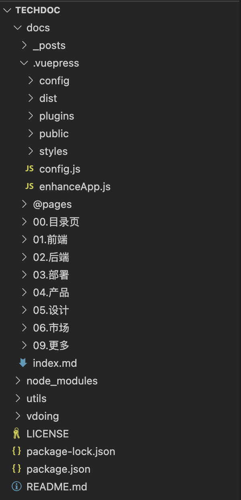

## 一. 环境准备

精灵知识库是基于`vue-press`搭建的，团队协作使用 `SVN`，编写文档需要具备以下条件。

::: tip
1. 安装 [svn](https://www.visualsvn.com/files/TortoiseSVN-1.14.3.29387-x64-svn-1.14.2.msi)
2. 安装 [npm]( https://nodejs.org/dist/v16.20.1/node-v16.20.1-x64.msi) (node 版本 <= 16)
3. 会使用 Markdown 编写文档
:::

## 二. 文档编写

### 1. 获取知识库工程

- 联系领导，创建SVN账号
- 获取工程 `svn://svn.risun-tec.cn:8445/techdoc`

### 2. 启动知识库工程

打开命令行窗口，进入知识库工程所在目录，执行如下命令：
``` shell
cd D:\techdoc
npm install 
npm run dev
```
命令执行成功后，在浏览器上访问 <a href="http://localhost:8080" target="_blank">http://localhost:8080</a>，即可看到知识库页面。

## 三. 文档规范



根据自己所属的部门，在对应的目录下创建文档。
- 文档的顺序按照文件名的序号排列（不用完全按照自然数）。
- 要在导航栏中添加文档链接，需要在 `config.js` 中添加
``` js
{
  text: '产品',
  link: '/product/',
  items: [
    { text: '原型制作', link: '/pages/827bds/' },
    { text: '文档规范', link: '/pages/926afc/' },
  ]
},
```
- 编写完成后没有问题的话，提交到SVN服务器即可。

